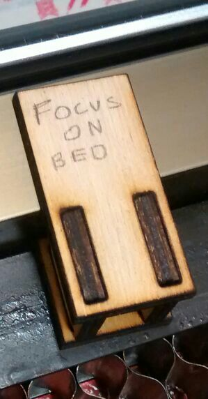

# Orange laser cutter

The Orange Laser Cutter is usable by members who have had an induction.

Top-level specifications:

-   A2-ish Bed size, 600mm x 400mm
-   60W Laser Tube (1250mm long / 55mm diameter)
-   Awesome Extraction
-   Air Assist
-   Red-dot laser for bounds checking
-   Smart cooling
-   Rise-and-fall bed, Super useful for engraving stuff on stuff

## Preparing a file for laser cutting

### Inkscape

For vector editing and manipulation, we suggest people use Inkscape. It
is a free and powerful vector editing package, and integrates well with
Visicut. It can be downloaded from [the Inkscape release page](https://inkscape.org/release).

## Operating the laser cutter

### Visicut

Visicut is the software that converts vector files into the code that
drives the laser cutter. You can download Visicut from [https://visicut.org](https://visicut.org/).

Some versions of VisiCut had issues on OSX; this is believed to be fixed, but if you see problems with it only redrawing when you resize the window, see [this issue on GitHub](https://github.com/t-oster/VisiCut/issues/171).

On first run, Visicut will ask if you want to download settings. You do,
just select **Manchester, UK: Hackspace** from the list and Visicut will
automatically install the latest settings for our laser cutter. You can
use this same method to reset your settings back to the default, under
the menu item **Options > Settings > Download Recommended
Settings**. You may get an error message, *error importing settings*. If
this occurs, just close and reopen Visicut for the settings to apply.

If you have Visicut and Inkscape installed, and have run Inkscape at
least once (so it creates its folders in your home drive), You can
install the Inkscape addon for Visicut by clicking **Extras > Install
Inkscape Extension** in Visicut. Close and reopen Inkscape and you
should have new options for sending vectors directly to Visicut. This isn't necessary to use the laser, but may be helpful.

### Safety

* The coolant pump *must* be running before cutting starts. This is a metal box near the laser cutter which has a two-digit temperature display when switched on.
* Leave the coolant pump on for at least 5 minutes after cutting finishes.
* Fume extraction must run while the laser is cutting. This starts automatically when the laser is working. If the extraction doesn't appear to be working, stop cutting.
* Stay close to the laser cutter and watch it at all times when it's cutting. Fires can start very quickly.

### In the event of fire / emergency

-   There is an emergency stop button on the top panel that is
    functional. Opening the lid will also stop the laser from firing.
-   If you can smother the fire in-place using a piece of stock, do so.
-   If you can't smother it in place, put it on the floor and try to
    stomp it out.
-   If the fire is in the laser and you can safely fight it use the CO2 extinghuser available next to the laser
-   If you can't do either of these, leave the space immediately, and
    call 999. The address is Wellington House, Pollard Street,
    Manchester, M40 7FS

### Problems other than fires

If the laser cutter does **anything** out of the ordinary please make sure it's reported to a laser maintainer. If the response is "please put the out of order sign on the cutter" then do that. **DO NOT ATTEMPT TO FIX THE CUTTER YOURSELF.** If it is clearly not functioning, put the out of order sign on it and then report it. We will fix it as soon as possible.

Even if the cut didn't work, let the cutter cool down for 5 mins before turning off.

### Control Panel

-   There is a small set of keyboard keys and small LCD screen which controls the laser. Menus can be selected by pressing left and right and pressing '*'.
-   The red button is a 'back' button in menus.

### Positioning the part

With the orange laser the only thing to worry about is the Z axis. There
is a switch on the right hand side of the machine that can be used to
lower or raise the main bed of the machine. It's a bit slow, but make
sure not to crash the bed into the laser head, since there isn't a limit
switch installed.

There is a small wooden guide inside the machine that can be used to
position / zero the height against the bed (the default position). This
goes in between the bed and the left-hand part of the laser cutter, as
in the following photo:

-   For cutting materials up to 6mm it's best to have the z height set
    to bed level.
-   For cutting materials over 6mm, try to keep the z height 6mm into
    the material. Multiple passes may be needed.
-   For engraving set the focal point to the height of the material by
    placing the guide on top of it.
-   If you want crisp engraving on thick stock, you will need to do a
    2-stage engrave / cut with the focal point initially set to the top
    of your material, and then re-set to the correct height for your
    cut.
-   If your material has a protective cover, try to leave the cover on both sides of the material,
    or if only one side the bottom (not the top)

### Test the Laser positioning

Next we're going to do a boundary test to make sure the laser cutter is
working on the area we think it's going to:

-   Click Execute in Visicut
-   Wait for the small LCD on the Cutter it to say the file name
-   Press the right arrow on the laser cutter to select "Boundary"
-   Press the centre '*' button, which will cause the red laser to
    trace the box outline of where the cut will be done on the material.
-   This can be done with the lid open to assist in placing your part,
    however please keep your hands/hair/ties out of the way of the moving parts.
-   Press the '*' button again to go back to the main menu.

### Do the cut

At this stage you should now be ready to do the cut for real.

-   Make sure the lid is closed, The laser won't fire with it open.
-   Check the coolant pump is still working and the temperature is below 25.
-   The LCD should show Run on the screen.
-   Press '*' button to start the run job.
-   Start a timer on your phone or watch so you know how much your job costs.
-   Keep watching the laser while it cuts to check nothing goes wrong (e.g. fires)
-   Check the extraction fan is working (you can tell either by the noise it makes, or by vibration of the exhaust hose).

### Logging and payment

-   There is a log book for keeping track of usage of the laser. Please write down your name and the length of time you've used the laser for in the front of the book.
-   The laser is currently billed by 10 minute or 1 hour increments, with the rate written on the laser cutter.
-   Laser fees can be paid in cash into a box near the laser, which should be clearly marked, or from your member balance at [the members' system laser page](https://members.hacman.org.uk/equipment/laser).
-   If you owe the laser fund money or have some credit (e.g. have paid with a £10 note and only used £3) record your balance at the back of the log book.

## Materials that can be used

|  Material Class  | Material |  Hazard Status | Potential Hazards  |  Special Notes | Suppliers  |
|---|---|---|---|---|---|
| Wood  |  Laser-grade MDF | 
Potential Risks
  | Increased risk of fire on multiple passes  | Makes the laser filthy which makes it harder to use and reduces the lifespan of parts - preference is for users to not use this material unless it's necessary  | [Fred Aldous](https://www.fredaldous.co.uk/) 
 [Kitronic](http://kitronic.co.uk) 
 [Hobarts](https://hobarts.com/) |
| Wood  | Standard MDF  | 
Banned
  | 	Chemical off-gassing, laser damage  | Glues use formaldehyde, which is both carcinogenic and damaging to the laser  |   |
| Wood  | Laser-Grade Plywood - Birch Ply  | 
Low Risk
  |   |   | [Fred Aldous](https://www.fredaldous.co.uk/) 
 [Kitronic](http://kitronic.co.uk) 
 [Hobarts](https://hobarts.com/)  |
| Wood  | Laser-Grade Plywood - Poplar Ply  | 
Low Risk
  |   |   | [Fred Aldous](https://www.fredaldous.co.uk/) 
 [Kitronic](http://kitronic.co.uk) 
 [Hobarts](https://hobarts.com/)  |
| Wood  | Laser-Grade Bamboo  | 
Low Risk
  |   |   |   |
| Wood  | Standard Plywood  | 
Banned
  | Chemical off-gassing, laser damage  | Glues use formaldehyde, which is both carcinogenic and damaging to the laser  |   |
| Wood  | Balsa wood  | 
Potential Risks
  | Potential for combustion, smoldering  | Pre-soaking with water may be safer - requires a high level of vigilance while cutting/engraving  | [Fred Aldous](https://www.fredaldous.co.uk/)  |
| Wood  | Paper  | 
Potential Risks
  | Potential for combustion, smoldering  | Light paper can easily become tinder. While etching is 'kindof' possible, it more leaves a carbon dust behind rather than impacting the paper. Cutting is functional and works well.  |   |
| Wood  | Card/Cardboard  | 
Potential Risks
  | Potential for combustion, smoldering  | Channels in cardboard can allow for unseen combustion, please cut and engrave with caution  |   |
| Wood  | General Wood (unprocessed/treated)  | 
Low Risk
 |   | Woods with lower resin content cut and engrave better.  |   |
| Wood  | cork  | 
Potential Risks
  | Potential for combustion, smoldering  | Channels and gaps in cork can allow for unseen combustion, please cut and engrave with caution, pre-soaking with water may be safer  |   |
| Plastics  | Thin Polypropylene sheet (<1mm)  | 
Low Risk
||||
| Plastics  | Acrylic AKA Perspex  | 
Low Risk
||||
| Plastics  | Foamcore (non-PVC variety)  | 
Low Risk
||||
| Plastics  | Correx (Genuine non PVC)  | 
Low Risk
||||
| Plastics  | Depron Foam  | 
Potential Risks
||||
| Plastics  | Plastics containing PVC (e.g. Sintra, Foamex)  | 
Banned
  | laser contamination, emissions  | Off-gasses chlorine gas when lased  |   |
| Plastics  | Plastics containing ABS (e.g. 'sheet styrene', Plasticard)  | 
Banned
  | laser contamination, fire risk  |   |   |
| Plastics  | Polycarbonate  | 
Banned
  | laser contamination, fire risk  |   |   |
| Plastics  | Polystyrene  | 
Banned
  | laser contamination, fire risk|||
| Plastics  | Polypropylene  | 
Banned
  | laser contamination, fire risk, emissions  |   |   |
| Plastics  | HDPE  | 
Banned
  | laser contamination, fire risk, emissions  |   |   |
| Foam  | PlastaZote Foam  | 
Low Risk
  |   | Thin material will need weighing/taping down, may cause bounce-back rarely. Engraves and cuts super-well  |   |
| Textiles  | Cotton  | 
Low Risk
  |   |   | [Abakhan Fabrics](https://www.abakhan.co.uk/)  |
| Textiles  | Hemp  | 
Low Risk
  |   |   |   |
| Textiles  | Unwashed/Greasy Wool  | 
Banned
  | Fire risk  | Lanolin in wool can cause fire and smolder  |   |
| Textiles  | Acrylic Felt  | 
Low Risk
  |   | 'Welds' the edges and can give a fray resistant edge, although this edge can be rough  | [Abakhan Fabrics](https://www.abakhan.co.uk/)  |
| Textiles  | Polar Fleece  | 
Low Risk
  |   | 'Welds' the edges and can give a fray resistant edge, although this edge can be rough  | [Abakhan Fabrics](https://www.abakhan.co.uk/)  |
| Textiles  | Stretch Cotton Jersey (t-shirt material)  | 
Low Risk
  |   |   | [Abakhan Fabrics](https://www.abakhan.co.uk/)  |
| Textiles  | Veg Tanned Leather  | 
Potential Risks
  | Foul odour, emissions, risks with tanning method  | Please check from the supplier that it is specifically vegetable tanned - other tanning processes and ingredients can be harmful. Cutting leather can also give off foul smells and be highly anti-social - please be aware of this when using the laser, and of your other hackspace members.  |   |
| Textiles  | Leather chrome-tanned, or unknown tanning agent  | 
Banned
  | Emissions  |   |   |
| Textiles  | Fake Leather  | 
Banned
  | laser contamination, emissions  | Off-gasses chlorine gas when lased  |   |
| Textiles  | PVC  | 
Banned
  | laser contamination, emissions  | Off-gasses chlorine gas when lased  |   |
| Ceramics  | Stone  | 
Low Risk
  |   | Engrave only.  |   |
| Ceramics  | Ceramic tile  | 
Low Risk
  |   | Engrave only.  |   |
| Ceramics  | Glass  | 
Low Risk
  |   | Engrave only.  |   |
| Composites  | Fibreglass  | 
Banned
  | laser contamination, fire risk, emissions  |   |   |
| Composites  | Carbon fibre  | 
Banned
  | laser contamination, fire risk, emissions  |   |   |
| Metals  |   | 
Banned
  | Can cause laser damage  | She might ''seem'' really eager, but it's probably best not to listen to her...  |   |
| Other  | Food  | 
Banned
  | laser contamination, fire risk, emissions  |   |   |
| Other  | Body Parts  | 
Banned
  |   |   |   |
| Other  | Lucy  | 
Banned
  | laser contamination, safety hazard  |   |   |
| Other  | Fresh Flower Oasis  | 
Banned
  | emissions  | Contains formaldehyde  |   |
| Other  | Laser rubber  | 
Potential Risks
  | laser contamination  | Requires immediate cleaning of the laser after cutting - this takes significant time, and takes the laser out of service until its done. Please only do this after consulting with the laser team.  |   |
| Other  | Non-Laser Rubber  | 
Banned
  | laser contamination, fire risk, emissions  |   |   |
| Other  | Flexible Magnetic Sheet  | 
Banned
  | Emissions (HCl)  | If you find a supposedly laser-safe version, please contact the laser maintainers for approval  |   |
| Other  | Asbestos (all types and products)  | 
Banned
  | Laser Contamination, H&S  | Someone asked, so we had to put this entry in  |   |

## Status

Status can be seen on the members page at [the members' system laser page](https://members.hacman.org.uk/equipment/laser). If there is a notice on the laser itself saying it is out of order, that takes priority.
