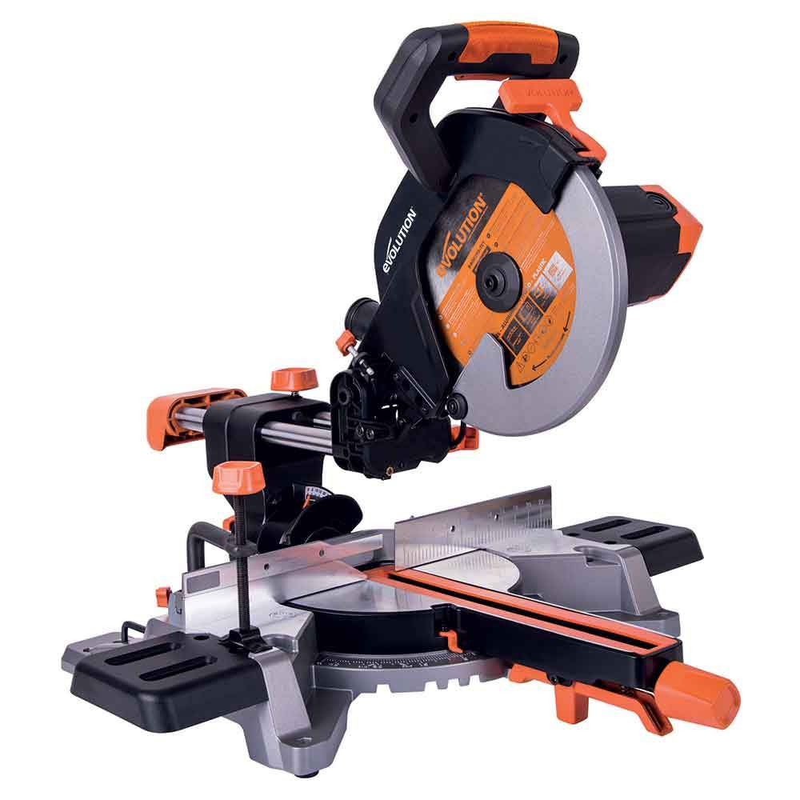
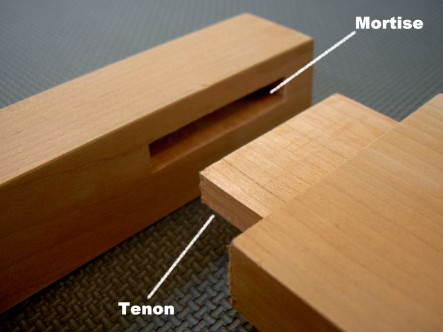
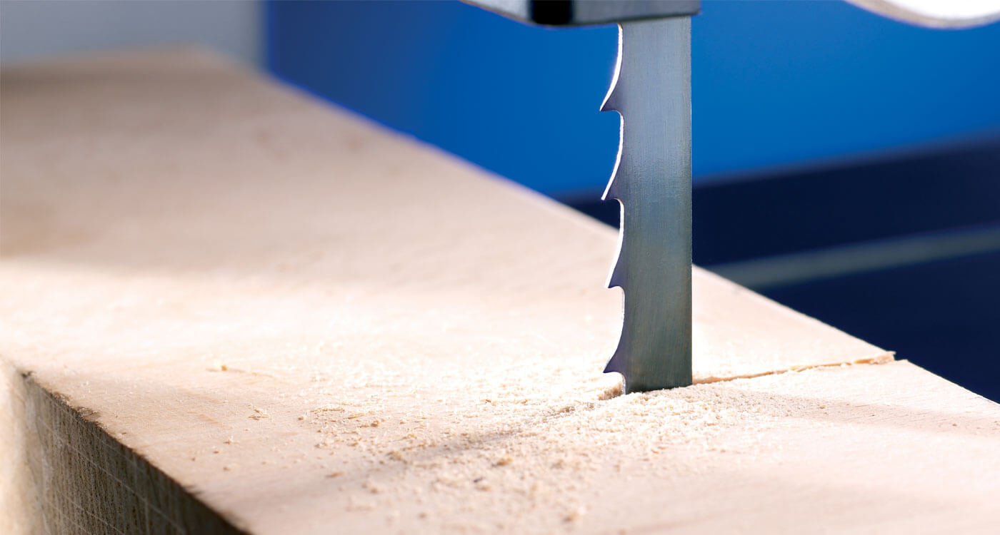

# Table of Contents

1.  [Mitre/Bandsaw induction](#org5089ede)
    1.  [Trainer-specific content](#orgf3f4a1d)
        1.  [Preparation for session](#org7a75a7b)
        2.  [Answers](#orgde7192d)
        3.  [Process](#org0987151)
    2.  [Overview of session](#org85221a8)
        1.  [Basic principles of safety in the workshop and principles in the use of any tool](#org04a5956)
        2.  [The induction will move to the workshop where the trainees will be split into groups. The instructors will demonstrate the controls on each tool and you will then have the opportunity to demonstrate you have understood.](#orgfdf6745)
        3.  [You will be given a quiz to take home and after answering the questions the instructor will mark you trained](#org2fe0490)
        4.  [The training is intended to show locations of controls and teach basic safe operation](#org03f3dbe)
    3.  [The tools in use](#org06b3ce3)
        1.  [Sliding mitre saw](#orgfc46ce6)
        2.  [Band saw](#orgfba34c3)
        3.  [Personal safety](#org46c325d)
    4.  [Processes for using any tool](#org1a1c9cc)
        1.  [Four questions](#org02e1b21)
        2.  [Ensure area with tool is safe](#org8e10685)
        3.  [Is the equipment safe/in good condition?](#org9cdb00f)
        4.  [Is this the right tool?](#orge93a5fd)
        5.  [Material considerations](#org6d64318)
        6.  [Minimising breakages](#org4bf0772)
    5.  [How to report faults/help out](#org6130af5)
        1.  [Only adjust angle controls etc. as an ordinary user](#orgc0a42b2)
        2.  [Use report signs with QR codes around the space to report faults, or post on telegram](#orgdade713)
        3.  [Put a sign on the machine to say it's out of order so people don't use it and have injuries](#org45d5453)
    6.  [Hackspace specifics](#orgc4388ac)
        1.  [Reiterate about yellow box area](#orga1f43fa)
        2.  [Do not store anything in woodwork](#org364fbfb)
        3.  [Scraps are free, but this system will be obsoleted](#org576c733)
        4.  [There is a library with some woodworking books](#org4236d7b)
        5.  [We don't have cleaners so ****leave the room tidy****.](#orgb676f48)
        6.  [Don't leave machines/items in the gangway and put wheeled tools back after use](#org0326a32)
    7.  [Mitre Saw](#orgb712c18)
        1.  [Controls](#orgd32c4a5)
        2.  [Preparation for cutting](#org1f6295e)
    8.  [Band saw](#orgca09e94)
        1.  [Controls](#org342af9d)
        2.  [Preparation for cutting](#org31fca17)
    9.  [Demo](#orgf3bcbf2)
        1.  [Mitre saw](#org0afdebb)
        2.  [Bandsaw](#org7263907)
    10. [Questions](#orgde31a21)
        1.  [What are the four questions you should ask yourself before doing anything in the workshop?](#org03daf69)
        2.  [How far should your hands be from the workpiece while the blade is in operation?](#org082f73e)
        3.  [How should you ensure your safety whilst checking blades on the machines?](#org687465a)
        4.  [How should you cut cylinders on the bandsaw?](#org8a4d355)
        5.  [What should you do if a machine is broken?](#org5585ccc)
        6.  [When should you not enter a yellow box area?](#orgf927121)
        7.  [When should you use dust extraction?](#org69bbd7a)
        8.  [How do you select mitre or rip guard?](#orgfa498ab)
        9.  [What should you do if you are cutting material such as MDF which has a higher than normal respiratory risk?](#orgb4d69f5)
        10. [What does the 'no lone working' rule mean?](#org291fcf8)

# Mitre/Bandsaw induction

## Trainer-specific content

### Preparation for session

-   [ ] Ensure all attendees are members
    -   Gather hackspace usernames beforehand

1.  Equipment

    -   [ ] Run through initial checks on all tools
        (Ensure to check the machine actually runs in case fuse is broken etc)
    -   [ ] Check vacuum cleaner works
    -   [ ] Check there is suitable and sufficient wood for training
        Do not use MDF or other toxic woods in session
    -   [ ] Check there are enough ear defenders and goggles for every attendee

2.  Things for demo

    -   [ ] Broken blade to demonstrate TCT blade breakage
    -   [ ] Vee block to demonstrate
    -   [ ] Metal detector and piece of wood containing metal

### Answers

1.  What are the four questions you should ask yourself before doing anything in the workshop?

    1.  Am I tired?
    2.  Am I in a rush?
    3.  Am I distracted?
    4.  Am I sure?

2.  How far should your hands be from the workpiece while the blade is in operation?

    15cm

3.  How should you ensure your safety whilst checking blades on the machines?

    Physically unplug the machine from power

4.  How should you cut cylinders on the bandsaw?

    Use a vee-block

5.  What should you do if a machine is broken?

    Stop using it immediately, report using a QR code sign or via telegram, place a sign on the machine to indicate it is broken.

6.  When should you not enter a yellow box area?

    When someone else is using a machine tool in that area.

7.  When should you use dust extraction?

    Always if it is available.

8.  How do you select mitre or rip guard?

    The material should be supported on its longest straight side.

9.  What should you do if you are cutting material such as MDF which has a higher than normal respiratory risk?

    Inform other workshop users

10. What does the 'no lone working' rule mean?

    At least one other person in the hackspace, do not have to be in woodwork.

### Process

-   After moving to the workshop, run through the checklist yourself in front of the attendees, then make them demonstrate.
-   Following correct demonstration, mark users off using their hackspace members' system username.
-   Provide link to recently trained group after session.

## Overview of session

### Basic principles of safety in the workshop and principles in the use of any tool

### The induction will move to the workshop where the trainees will be split into groups. The instructors will demonstrate the controls on each tool and you will then have the opportunity to demonstrate you have understood.

### You will be given a quiz to take home and after answering the questions the instructor will mark you trained

### The training is intended to show locations of controls and teach basic safe operation

Further study and practise will be required to get good results

## The tools in use

### Sliding mitre saw

1.  What is it for?

    1.  Cutting precise cuts in beams and narrow boards
    
    2.  Framing etc.
    
    3.  Cross cuts (across the grain)

### Band saw

1.  What is it for?

    1.  Narrow blade allows very little wastage of material
    
    2.  Blade is perpendicular so can be used to cut mortises etc.
    
        
    
    3.  Material that is not planed
    
    4.  Performs best on rip cuts (along the grain)
    
    5.  Curved cuts (on red bandsaw) (15mm minimum radius)
    
        Straight cuts only on green bandsaw

### Personal safety

1.  Required

    1.  No lone working
    
        At least one other person must be in the space. They do not need to be in woodwork; but make sure people tell you if they're leaving if you're one of the last. It is permitted to have a guest for the purposes of safety, but they are not allowed to use the tools/
    
    2.  Long hair tied back
    
    3.  Loose sleeves etc. secured/rolled up
    
    4.  Flat, close toed shoes
    
    5.  Goggles
    
    6.  **No** gloves whilst using machine tools
    
        Increased risk of entrapment
    
    7.  Push sticks when closer than 15cm to blade

2.  Recommended

    1.  Ear defenders
    
        Be aware that hearing damage occurs with lower levels of noise over a long period as well as with short bursts of loud noise; so err on the side of caution.
    
    2.  Breathing protection (mask) of FFP2 or better
    
    3.  Barrier cream
    
        Moisturiser-like product that products against irritation when coming in contact with workplace toxins

## Processes for using any tool

### Four questions

1.  Am I tired?

2.  Am I distracted?

3.  Am I in a rush?

4.  Am I sure?

### Ensure area with tool is safe

1.  Do not enter yellow boxed areas if another user is using a power tool there (including for work not using a power tool).

2.  If you are using a larger piece of stock, ensure there is enough space for you.

### Is the equipment safe/in good condition?

1.  Physically unplug the machine for checks where you check cutting tools.

    1.  Blade not missing teeth
    
        (Note difference between TCT and conventional blade types)

2.  Noises/etc.

3.  Machine and area around machine clear of dust

    Important to also check the floor, as dust is a slip hazard

4.  Is dust extraction connected (when available)

5.  Do I have push sticks available?

6.  Are there any trip hazards.

7.  Is machine at a neutral angle etc.

    1.  Previous users may have adjusted the tool such that it is at an angle other than 90 degrees, so check this yourself to avoid disappointment

### Is this the right tool?

1.  Can I safely hold the work?

2.  Is material suitable dimensions?

3.  Is there sufficient clearance around the machine for my whole operation

4.  Using guards

    -   Longest side of material should be on a guard if one is used
    -   If you're cutting along the length of a piece (along the grain on non-manufactured woods) use a rip guard
    -   If you're cutting along the width of a piece (across the grain on non-manufactured woods) use a mitre guard

### Material considerations

1.  Does my material contain metal etc?

    A metal detector is in the space which you should use if you are using reclaimed wood.

2.  Is material clean

    Material should not be oily etc so it doesn't gunk up the machine. Dirty material also has an increased risk of containing contaminants etc.

3.  Respiratory risks

    -   All wood produces fine dust
    -   MDF contains formaldehyde
    -   Treated wood contains various chemicals
    -   Wood naturally contains toxins and causes reactions. Research whatever you're using, referring to <https://www.wood-database.com/wood-articles/wood-allergies-and-toxicity> (accessed 26/11/23)
    -   Inform other people in the room if you're cutting something with high toxicity (as a guideline above 2 stars potency on the list linked, or MDF/treated wood).

### Minimising breakages

-   Bring blade to full speed before inserting material into its path
    Starting the machine with material touching the blade will overload the engine.
-   If the machine sounds wrong or is struggling a lot, go slower or stop using it and report broken if this isn't possible.
    The blades do blunt over time. Forcing stuff through the bandsaw is most likely to break it.

## How to report faults/help out

### Only adjust angle controls etc. as an ordinary user

Calibration is done by maintainers. The wood team maintainers are volunteers. If you are practically minded and believe this is something you could do, feel free to reach out and ask if you can join the team. However, do not adjust anything without being part of the wood team as not knowing who has touched what makes their job much more difficult as well as leading to health and safety risks and damaged equipment.

### Use report signs with QR codes around the space to report faults, or post on telegram

### Put a sign on the machine to say it's out of order so people don't use it and have injuries

## Hackspace specifics

### Reiterate about yellow box area

-   Do not enter yellow boxed areas if another user is using a power tool there (including for work not using a power tool).

### Do not store anything in woodwork

-   If large storage is full, you must either clear outdated items out or store elsewhere

### Scraps are free, but this system will be obsoleted

### There is a library with some woodworking books

### We don't have cleaners so ****leave the room tidy****.

### Don't leave machines/items in the gangway and put wheeled tools back after use

## Mitre Saw

### Controls

1.  Bevel control

2.  Mitre control

3.  Safety lock (i.e. the second button on the handle to release)

4.  Start/stop button

5.  Movable guards

### Preparation for cutting

1.  Check material is correctly located and secured

2.  Blade teeth pointing the right way

    
    Ensure mitre teeth are pointing towards the back of the machine

## Band saw

### Controls

1.  Guard height adjustment

2.  Mitre fence

3.  Rip fence

### Preparation for cutting

1.  Check material is correctly located and secured

2.  Blade teeth pointing the right way

    

3.  Use vee block when cutting round material

    This is a simple device that can be homemade which prevents round material from rotating and pulling your hand into the blade
    

## Demo

### Mitre saw

1.  Checks/demo whilst unplugged

    -   [ ] Show how you would check the blade
    -   [ ] Show where bevel setting is and operate it
        -   [ ] Stop at detents
        -   [ ] Stop at arbitrary angle
    -   [ ] Show where mitre setting is and operate it
        -   [ ] Stop at detents
        -   [ ] Stop at arbitrary angle
    -   [ ] Show where sliding fence control is and how you'd determine if it's necessary
    -   [ ] Explain which way the teeth should face

2.  Checks/demo whilst connected to power

    -   [ ] Cut straight cut
    -   [ ] Cut compound cut, moving guide if necessary

### Bandsaw

1.  Checks/demo whilst unplugged

    -   [ ] Show how to raise and lower wheeled stand
    -   [ ] Show inspection of top door for tracking
        -   Open top door, check saw is in the middle of the wheel
    -   [ ] Show inspection of bottom door for cleanliness
        -   Ensure cabinet is mostly clear of sawdust. Sawdust reaching the wheels can be a fire hazard
    -   [ ] Show how to check integrity of blade
        -   Explain which way the teeth should face
        -   Check for any missing teeth. Do not proceed if missing teeth are found.
    -   [ ] Show how to check blade tension
    -   [ ] Set guard the correct distance from the top of the workpiece.

2.  Checks/demo whilst connected to power

    -   [ ] Show how to check for bent teeth
        -   Listen for rhythmic click when machine is turned on
    -   [ ] Make straight cut
    -   [ ] Make curved cut on appropriate bandsaw

## Questions

### What are the four questions you should ask yourself before doing anything in the workshop?

### How far should your hands be from the workpiece while the blade is in operation?

### How should you ensure your safety whilst checking blades on the machines?

### How should you cut cylinders on the bandsaw?

### What should you do if a machine is broken?

### When should you not enter a yellow box area?

### When should you use dust extraction?

### How do you select mitre or rip guard?

### What should you do if you are cutting material such as MDF which has a higher than normal respiratory risk?

### What does the 'no lone working' rule mean?

