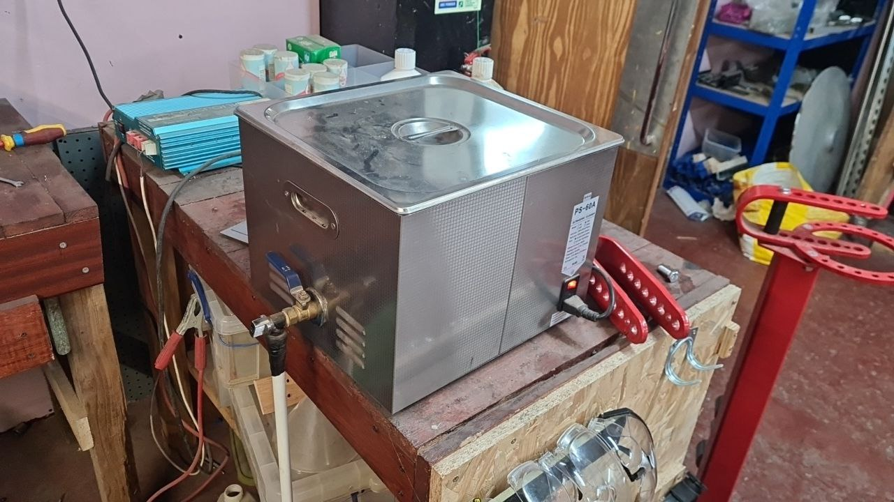
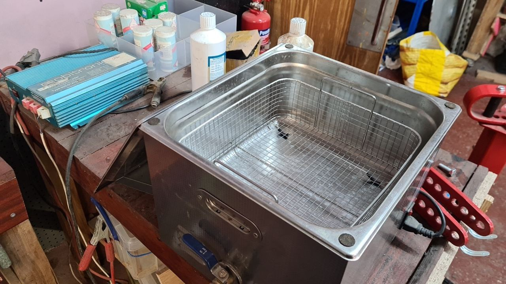
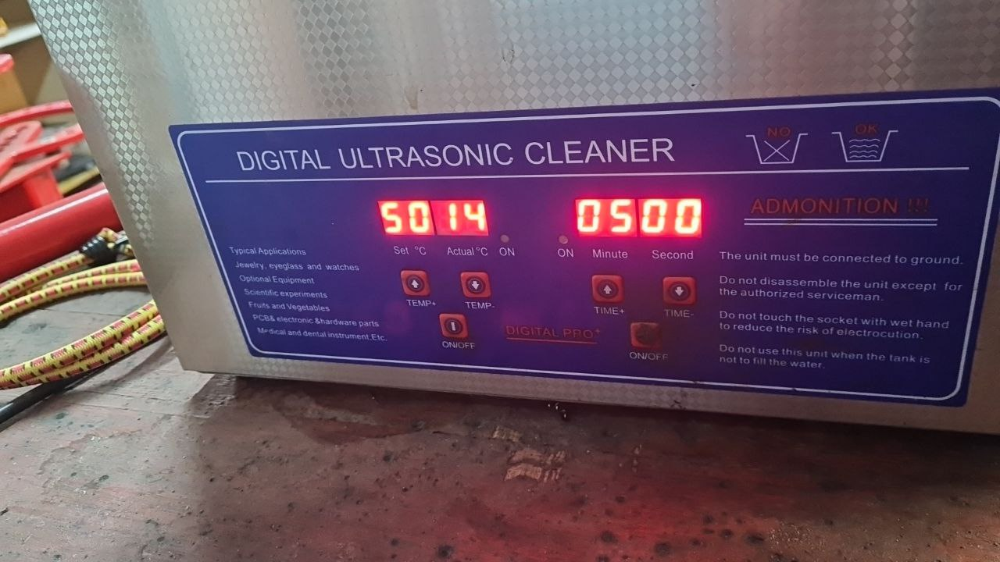
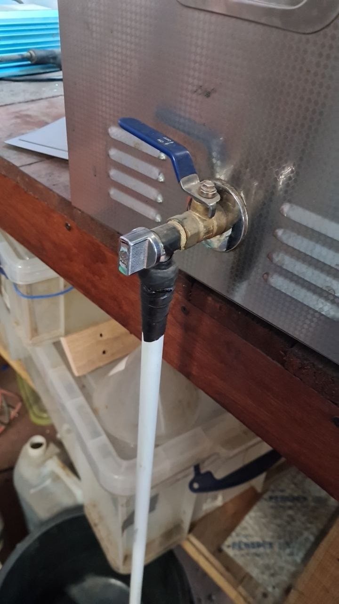
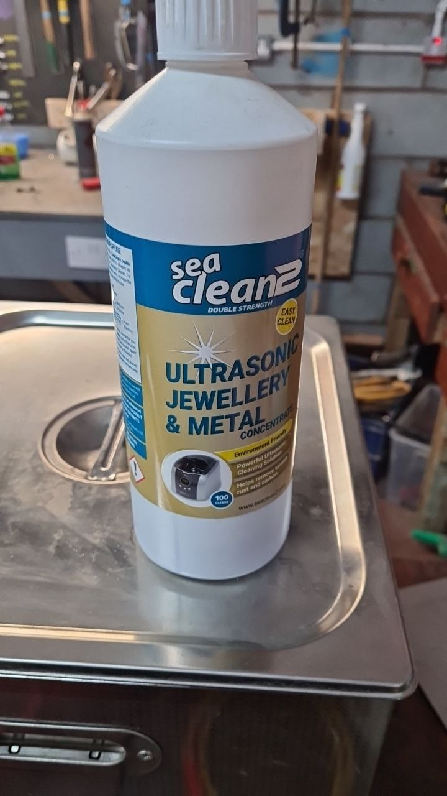
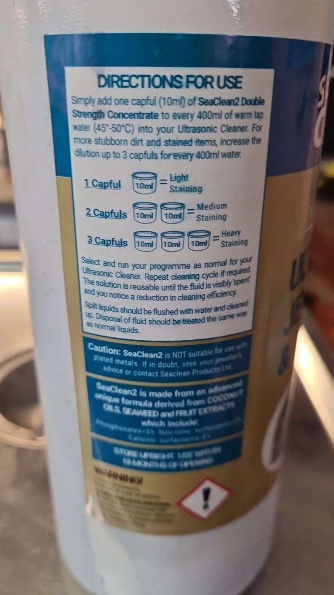

# Ultrasonic Cleaner

The ultrasonic cleaner is on perma-loan from the user garlicbread / Richard  

  * Please do not damage the equipment.
  * Please do not leave the machine in a dirty / messy state

Things to avoid:

/// admonition | Important
    type: warning

  * Do not use acetone or chorosive chemicals in the cleaner.  
    It's best to only use water in the main container mixed with concentrate.  
    chemicals such as acetone could cause the drain to melt.

  * Do not run the cleaner for more than 5mins at a time.  
    It's best to run it for a 5min burst, let it rest for a few mins then repeat if needed.  
    The timer should default to 5mins anyway.

  * Do not turn on the heater without water.  
    If the heater is on with no water in this can cause damage to the machine

///

## Control Panel

The control panel has two controls

  * The amount of time to run for / count down before stopping
    This defaults to 5mins
  * The temperature for the heater.
    The cleaner runs a lot better if the water is hot at around 45-50C which is recommended by the concentrate
    Do not heat without water in the tub

## Drain

There's actually two taps on the drain, twisting the silver one is easier.

## Cleaning Concentrate

The cleaning concentrate we have is for use with cleaning metal.
although you can also use soap such as dish washing soap, the concentrate just works better for metals

## Re-using the Concentrate

One way to re-use the concentrate is to try and filter it through a coffee filter.  
This can help prolong the supplys
