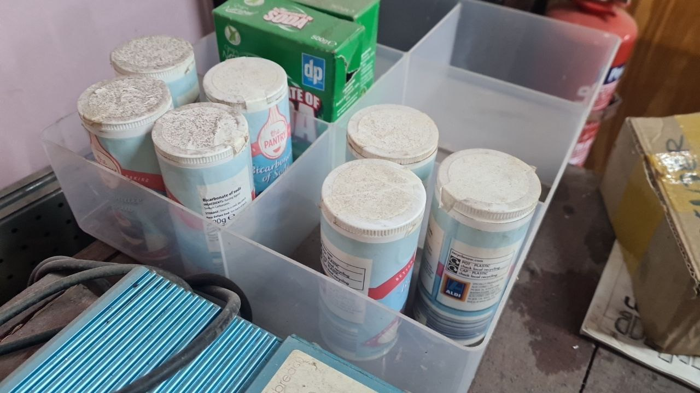
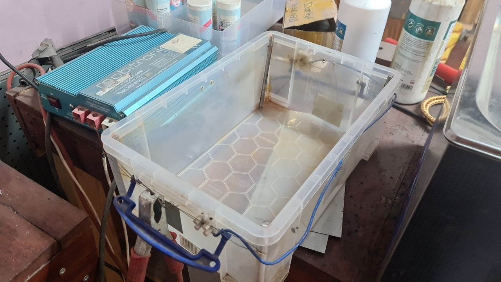
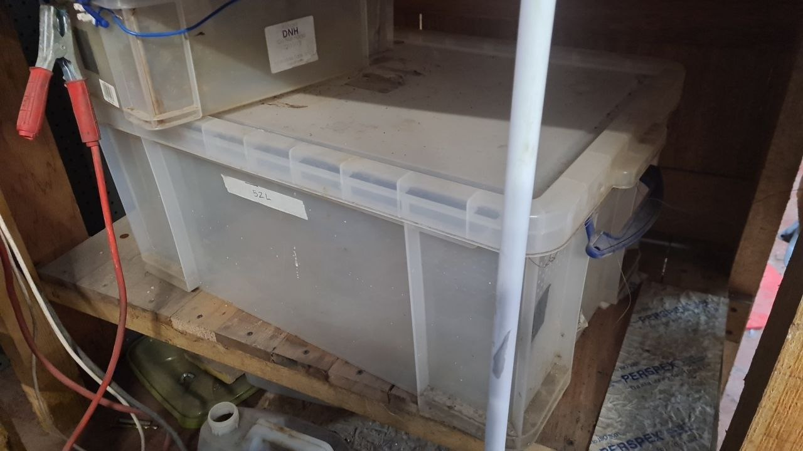
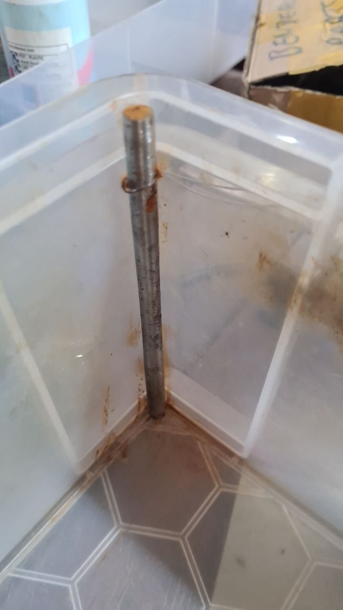
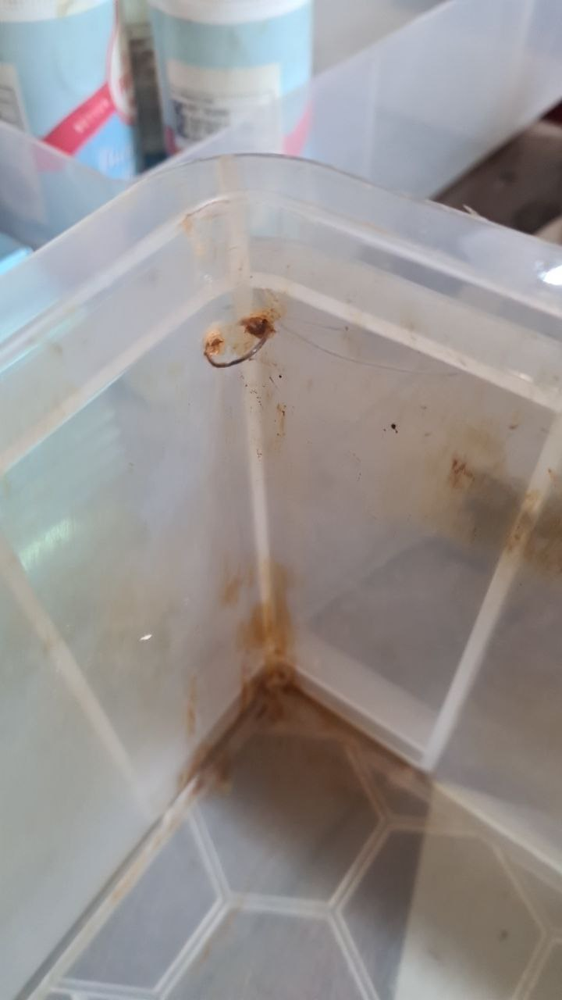
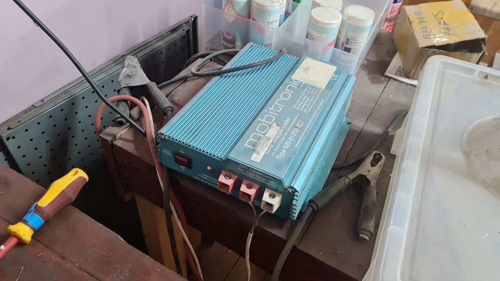
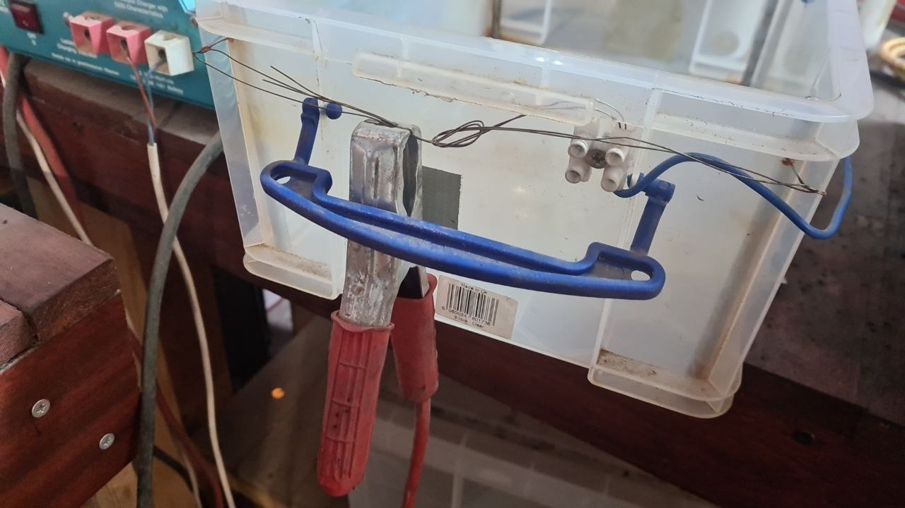
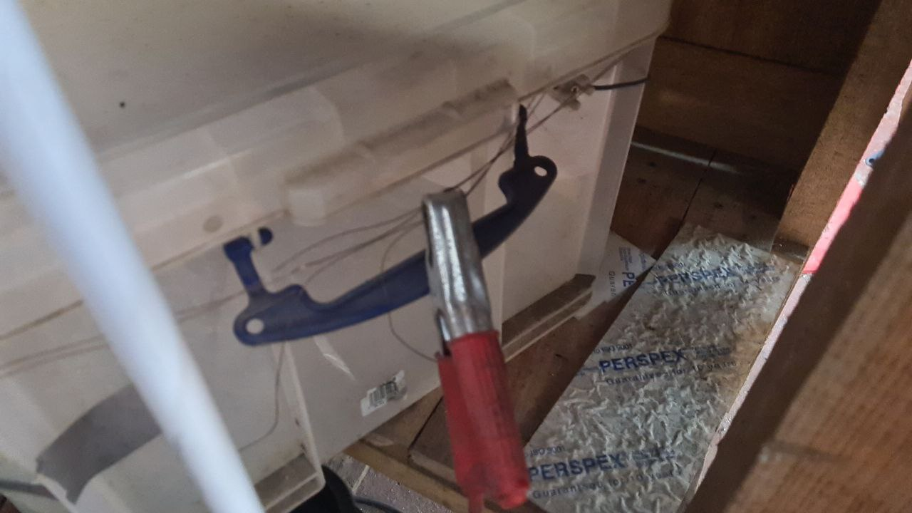
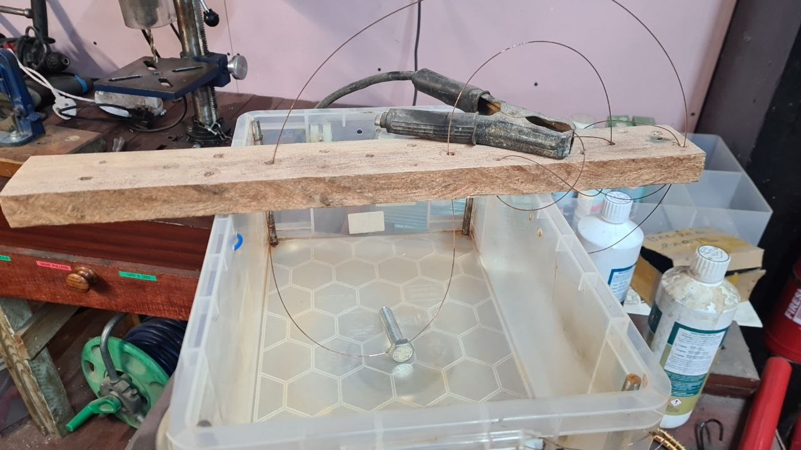

# Derusting with Electrolysis

## Overview

This is a list of instructions and details on how to use the electrolysis tanks.
Currently this can be used to remove rust from metal parts.

  * <http://www.robotroom.com/Rust-Removal-2.html>

## Types of Water

Ideally de-ionised water can be used, but so far I've used it with normal tap water without problems

When using normal tap water the end result is that some of the red rust may turn black.
This can be removed with a wire wheel.
You might ask why use electrolysis instead of just a wire wheel, in the case of electrolysis it can help to reverse some of the damage.
Also black rust can act as a protective layer in some cases.

### BiCarb

The main ingredient other than water is Bicarbonate of Soda.  
Note Baking Powder should be avoided since it has other things in which interfere with the process.

  * 6 Litres of water = 40ml of Bicarbonate of Soda
  * 5 gallons of water = 1/2 cup of Bicarbonate of Soda
  * 2 gallons of water = approx 1/4 cup of Bicarbonate of Soda

TODO image of measuring jug

### Cleaning the black coating

  * <http://www.metaldetectingworld.com/remove_black_coating_p27.shtml>

After using Electrolysis to remove rust from a part sometimes there will be a black coating left over. This can be avoided by using de-ionised water
although another way around this is to use a mixture of Water, Toothpaste, Baking Soda

## Tanks

Currently we have two tanks.
These are basically really useful boxes that have metal rods at each corner wired up with welding wire.

### Electrodes

There are 4 metal rods one at each corner of the tank with a wire loop around the top.
This makes the rods easy to take out and cleanup if they accumulate too much rust as part of the process 

## Power Supply

The power supply is a fixe 12V car battery charger, this is able to supply a lot of current at a fixed voltage so is good for this.

### Cabling

The positive or red clamp should be attached to the outside of the tank

The negative should be attached to the part
With the below this is actually a block of wood with some welding wire running through it.

## Plating

Plating is not something I have not tried myself
Also you may need a current controlled supply from the electronics area for better control.

/// admonition | Important
    type: warning

I would strongly suggest to avoid anything involving strong acids
///