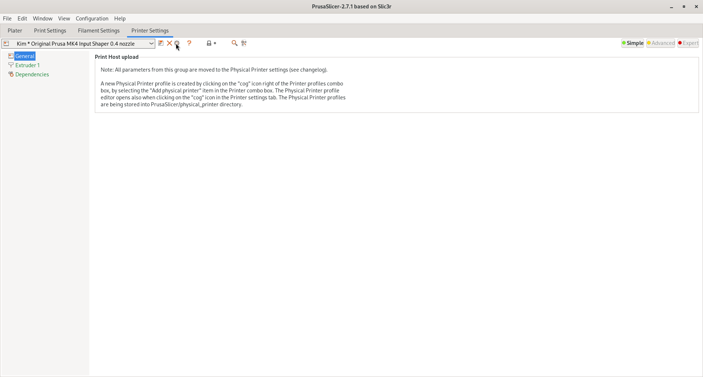
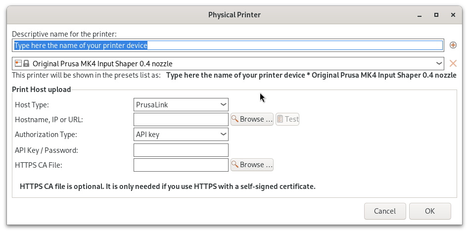

# How to setup the MK4's in PrusaSlicer


Select MK4 with or without [input shaping]([Input Shaper (MK4, XL, MINI/+) | Prusa Knowledge Base](https://help.prusa3d.com/article/input-shaper-mk4-xl-mini-_451816))

# How to connect to add them to PrucaSlicer



Press "add physical printer"



and add in the details to below

| Name (and username) | Ip-Address   | Prusa-Link key  |
| ------------------- | ------------ | --------------- |
| Kim                 | 172.16.0.123 | dmAPJnhhJ37VXBV |
| Romanov             | 172.16.0.124 | K2j5K9jNUwi4Aud |

```

```

[PrusaLink setup (MK4, MK3.9, XL, MINI/+) | Prusa Knowledge Base](https://help.prusa3d.com/guide/wi-fi-and-prusalink-setup-mk4-mk3-9-xl-mini-_413293#416077)
