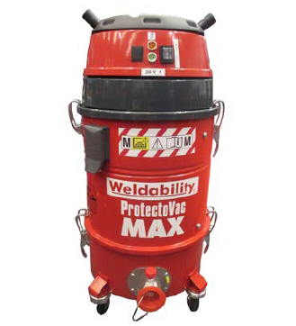

# Fume Extraction Unit

| Image                              | Description                                                                                                                                                                                                       |
|------------------------------------|-------------------------------------------------------------------------------------------------------------------------------------------------------------------------------------------------------------------|
|  | At the Hackspace we have one ProtectoVac Max Extractor 230 unit. This extraction unit used **only to extract fumes and particles when welding in the welding area**. |

## Characteristics

- The ProtectoVac Max is quality, low-cost, extraction unit. Designed for extraction of fumes and dust directly at the source.
- Integrated filter cleaning system removes the ongoing cost of filter disposal. The ProtectoVac Max filter can be manually cleaned, and the filtered material captured in a bin.
- 110V or 230V, powered by a powerful single-phase motor.
- Automatic stop/start available.
- 15 litre detachable dust collection chamber with handle.
- Metal pre-filter stops sparks.
- Castors for easy manoeuvrability.
- Suitable for use in the workshop, demonstrations, training bay, garage and on site.
- 2m x 50mm flexible hose with magnetic nozzle.

## Documentation

- [Product Information](protectoVac/pvacmax_pi.pdf)
- [MSDS Data Sheet](protectoVac/protectovacmax_manual.pdf)

### Risk Assessments
[Risk Assessment](https://docs.google.com/document/d/1Pf4_sP4e9LW16PtBELJbvsHrfuWLs_itcXTn2hc8TfE/edit?usp=sharing)

[Category:Equipment](Category:Equipment "wikilink")
[Category:Stubs](Category:Stubs "wikilink")
