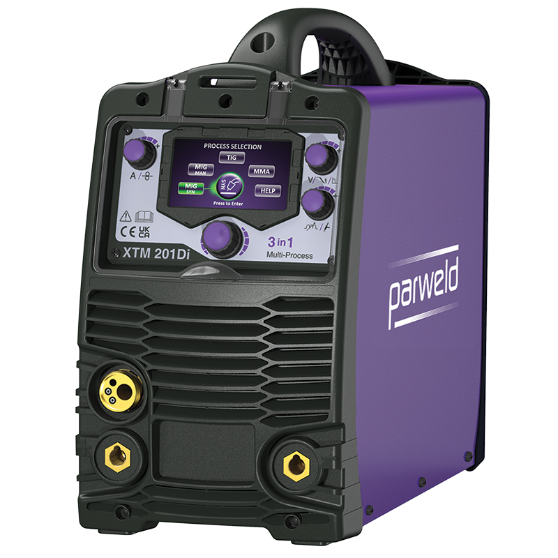

# Welding Machines

## XTM 201Di

| Image                                   | Description                                                                                                                                                                                                                                                                                                                                                                                                                                                                                                                                              |
|-----------------------------------------|----------------------------------------------------------------------------------------------------------------------------------------------------------------------------------------------------------------------------------------------------------------------------------------------------------------------------------------------------------------------------------------------------------------------------------------------------------------------------------------------------------------------------------------------------------|
|  | The 200A 3 in 1 Multi-Process Inverter Machine [XTM201Di MIG Machine](https://parweld.com/product/xtm201di/) is ideal for welding Stainless Steels, Steels and Aluminium using MIG, DC TIG or MMA Processes. This Welding Power Source Machine is suitable for site work, maintenance and repair work. The multi-language innovative digital interface allows machine setup with minimal process knowledge. The helpful display guides the user through the machine setup fron how to connect the power source for the chosen process, right through to the correct settings for the particular material thickness. |

### Characteristics

- Smart Switching Dual Voltage 100V / 230V 
- Digital Multi-Language Interface 
- Rapid Synergic Setup for MIG, TIG & MMA Welding 
- Supplied with MMA Lead Set, Input Cable and Gas Hose

### Documentation

- [XTM201Di Operator Manual ](xtm201di/Instructions_XTM-201Di_Issue-3.pdf)

### Videos

- [XTM 201Di MULTI PROCESS MIG INVERTER](https://www.youtube.com/watch?v=3G1hJrQry28)
- [XTM 201Di MMA Machine Welding Setup](https://www.youtube.com/watch?v=jucLqCA6c6g)
- [XTM 201Di TIG Machine Welding Setup](https://www.youtube.com/watch?v=MqrYoK6m0WU)
- [XTM 201Di MIG Machine Welding Setup](https://www.youtube.com/watch?v=e8vuY6fhEuE)

### Risk Assessments

[Risk Assessment](https://docs.google.com/document/d/1Nxx7gC6ZlFJ3FDdt4ViFRJvyCdW8pJC49f7d4CRjHVY/edit?usp=sharing)

[Category:Equipment](Category:Equipment "wikilink")
[Category:Stubs](Category:Stubs "wikilink")
