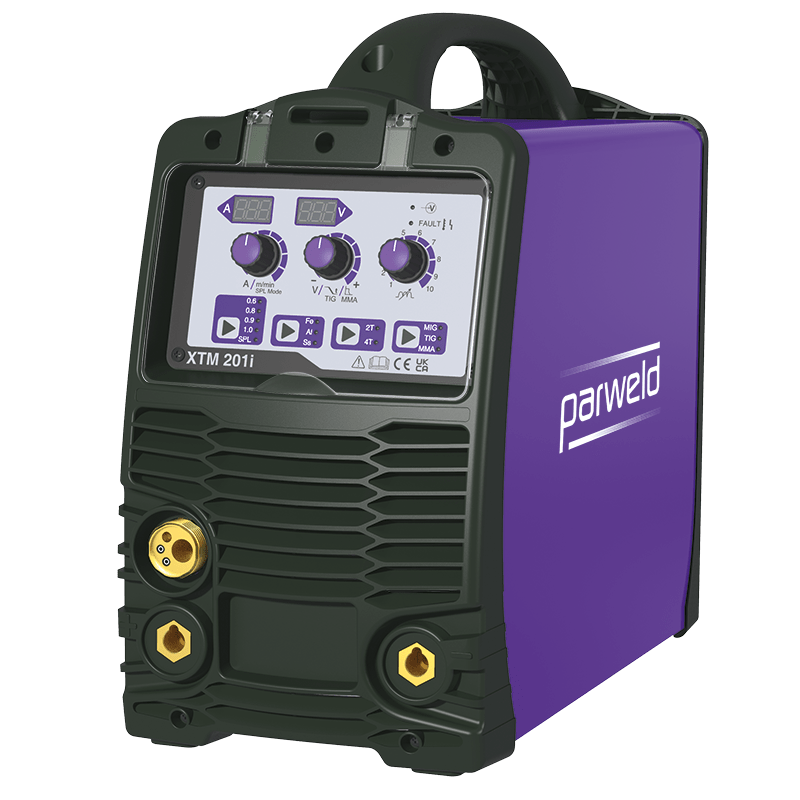

# Welding Machines

## XTM201i Inverter MIG

| Image                                | Description                                                                                                                                                                                                                                                                                                                                                                                                                                  |
|--------------------------------------|----------------------------------------------------------------------------------------------------------------------------------------------------------------------------------------------------------------------------------------------------------------------------------------------------------------------------------------------------------------------------------------------------------------------------------------------|
|  | Portable 230V Single Phase MIG Power Source Inverter Welding Machine from [Parweld](https://parweld.com/). The XTM 201i is able to cope with inputs which fluctuate by +/-15% & can be used with the majority of generators. Materials up to 4mm can be welded with ease. Synergic control provides rapid setting. Can be used in MMA, Lift TIG, MIG manual and synergic with or without GAS. Wire sizes of 0.8-1.0mm can be used with ease. |

### Characteristics

- 230V Single Phase Machine
- Synergic MIG
- Lift TIG and MMA Welding
- Compact and Portable
- 200A @ 25% Duty Cycle
- Gas or Gasless Operation Options
- 2T / 4T Trigger Latching
- Accepts 5kg (200mm) Spools
- Supplied with 3m Earth Lead

### Documentation

- [XTM201i Operator Manual ](xtm201i/XTM-161i_201i-Operator-Manual-Issue-2.pdf)

### Risk Assessments

[Risk Assessment](https://docs.google.com/document/d/1Nxx7gC6ZlFJ3FDdt4ViFRJvyCdW8pJC49f7d4CRjHVY/edit?usp=sharing)

[Category:Equipment](Category:Equipment "wikilink")
[Category:Stubs](Category:Stubs "wikilink")
