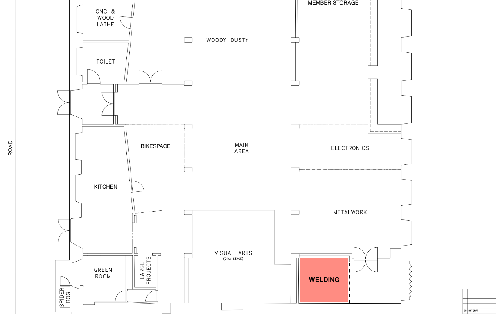

# About

This is a dedicated welding/grinding area, equipped with essential tools and safety gear, it offers a practical
and creative hub for hot work enthusiasts within the Hackspace community.

## Location

Our welding/grinding area is located between the metalwork area and the visual arts area.

## Contact

|   |                                                                              |
|---|------------------------------------------------------------------------------|
| [Co-ordinator](https://t.me/diazwatson)                | Member responsible for the area.                                             |
| [Team](https://list.hacman.org.uk/g/Team_Welding)      | List of members of the Welding Team.                                         |
| [Forum](https://list.hacman.org.uk/c/space/welding/51) | All discussions related to with our welding area.                            |
| [Telegram](https://t.me/HACManchester/211848)          | For anything related to welding/grinding, or matters relating to this area. |

## The Co-ordinator

The welding/grinding area co-ordinator is the person with these responsibilities:

- Helping members get involved in their area (making, maintenance, training, upgrading, etc.)
- Being the member’s point of contact for an area
- Coordinating decisions within that area
- Communicating activities of the area to directors and membership
- Helping organise area meetings and activities when needed

## The Welding/Grinding Team

This area is managed by the [welding team](https://list.hacman.org.uk/g/Team_Welding). Their responsibilities are:

- Attending team meetings
- Assisting the Board & Sub-committees when required
- General upkeep & maintenance of equipment
- Managing stock of consumables and procuring more when necessary
- Managing training resources & member inductions

## Inductions [TBC]

...

## Safety

Safety is one of our top priorities at the Hackspace. In this area, we provide Personal Protective
Equipment (PPE) for members to use and also have clear instructions and safety rules prominently displayed. 

These guidelines are there for everyone's protection and must be followed at all times when using the workshop facilities.
Ensuring a safe and responsible working environment is crucial for all members.

/// admonition | Important
    type: warning

If you find any PPE is missing or damaged please contact [The Welding Team](https://list.hacman.org.uk/g/Team_Welding) asap via [Telegram](https://t.me/HACManchester/211848).
///

Due to the nature of welding/grinding it is common to find members using the equipment that requires PPE.
As such we recommend that all members within woodwork wear the appropriate PPE whenever equipment is being used.

### PPE available in the welding/grinding area

- Goggles
- Ear Defenders
- Leather Aprons
- Welding/Grinding masks
- Welding/Grinding gloves
- Welding aprons

/// admonition | Note
    type: note

You are free to bring your own PPE equipment, however it MUST be suitable for the task at hand.
///
### PPE you must have

- P3 Respirator such as [option1](https://www.amazon.co.uk/dp/B01B6CT66E?psc=1&ref=ppx_yo2ov_dt_b_product_details), [option2](https://www.screwfix.com/p/jsp-force-8-medium-mask-respirator-with-press-to-check-filters-p3/1863f), [option3](https://www.screwfix.com/p/gvs-spr501-medium-large-half-mask-respirator-p3/6922g)

/// admonition | Important
    type: warning

When attending to induction or when working in the welding are you MUST bring your own P3 respirator.
///

### Risk Assessment [TBC]

Area [Risk Assessment](https://docs.google.com/document/d/12_7Fmfi2G1PTsVlbY8PHQK0ZIrzQaFeqpwH_IYf3CFU/edit?usp=sharing)