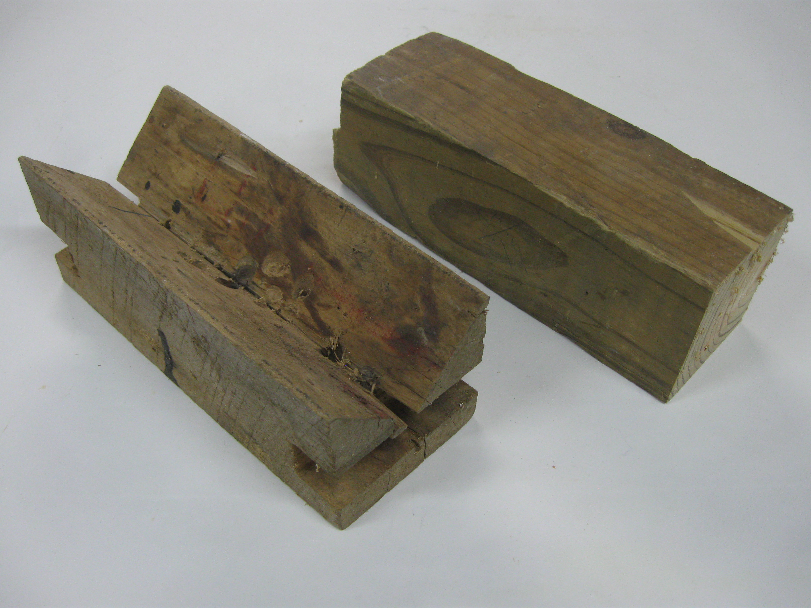

Bandsaw
=======

What is it for?
---------------

1.	Narrow blade allows very little wastage of material

2.	Blade is perpendicular so can be used to cut mortises etc.

	

3.	Material that is not planed

4.	Curved cuts (on machine fitted with narrower blade)

5.	Straight cuts only on machine fitted with wider blade

Controls
--------

1.	Guard height adjustment

2.	Mitre fence

3.	Rip fence

Preparation for cutting
-----------------------

### Check material is correctly located and secured

### Blade teeth pointing the right way

### Use vee block when cutting round material

This is a simple device that can be homemade which prevents round material from rotating and pulling your hand into the blade

