# Table Saws

## What are they for?

Cutting accurately and precisely on planed wood with a flat edge

## Kickback

Kickback is a particularly important mechanism to understand when using the table saw. In normal operation, the teeth of
the saw will push the workpiece downwards into the table; however if the workpiece grips the saw at the back, it will be
launched forwards.

Even the best woodworkers make mistakes, but with some preparation and understanding you can reduce the risk of kickback
and the severity of its consequences.

## Controls

### Crown Guard
This is a crown guard:

The crown guard is there to protect fingers and to protect the user against kickback. While some cuts may need the crown
guard to be removed, you should keep it on whenever possible as this is the safest way to use the saw. 

If you need to remove the crown guard, you can do so by unscrewing the wingnut and lifting it up and off the blade:

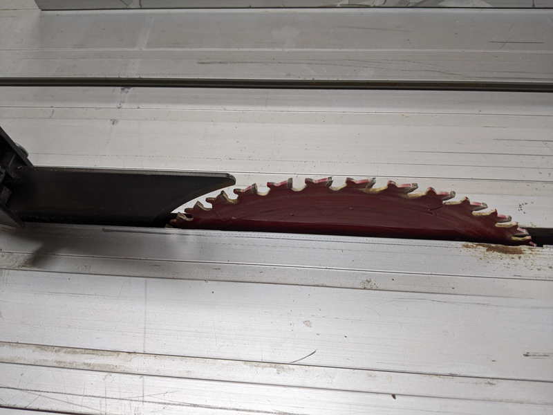

### Blade height

The blade should be high enough to go through the wood but not excessively high. You adjust the blade height using this dial. :

When you've got the blade at the height you want it, ensure that the wood can slide under the crown guard comfortably.

### Blade Angle

A table saw can be used to make angled cuts. To adjust the angle of the blade, you use this dial:

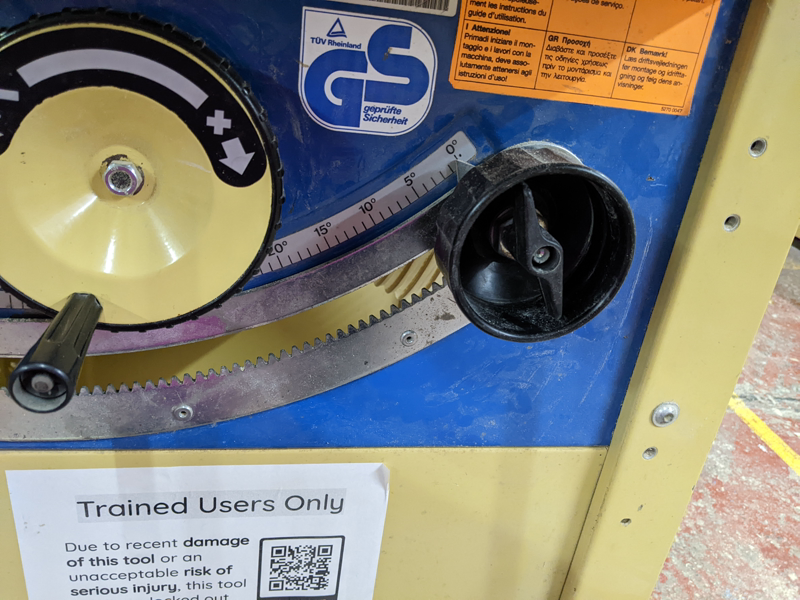

Loosen the screw on the dial, and you will be able to move the dial to the required angle. Ensure that the crown guard is removed when you do this.

### Rip Fence and Crosscut Fence
This is a rip fence:

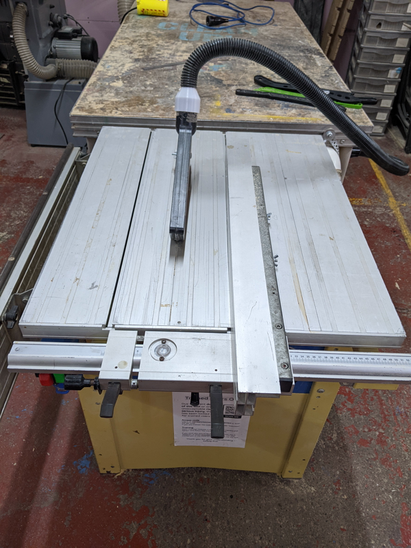

This is a crosscut fence:

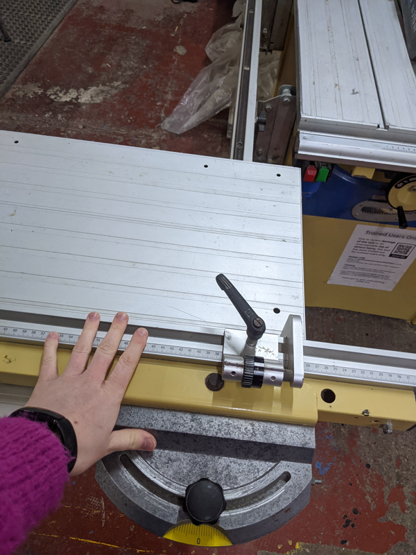 

The cross and rip guides are so named because with natural boards, the grain runs along the length of the board. When
you crosscut, you cut across the grain; and when you rip cut, you cut along the grain, ripping the grain apart.

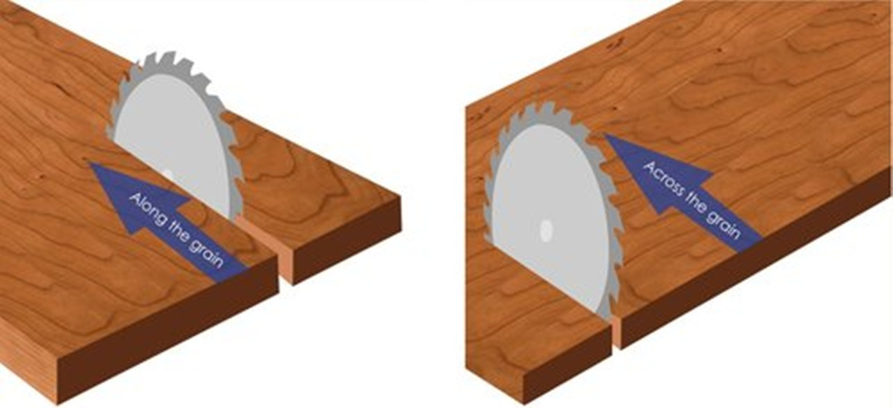

With manufactured boards, the grain may be in both directions (as with plywood), or there will be no direction to the grain at all (as
with MDF or chipboard). When choosing which fence to use, you must choose the one that supports the longest edge of your
workpiece. Do not use the machine while both guides are attached, as this is a common cause of kickback.

The rip fence should be on the table saw when you come to use it and, if you remove it, you should put it back when
you're tidying up after use. To position it, you simply pull the levers upwards and slide it closer or further away
from the blade.

To secure it, first push down this lever:

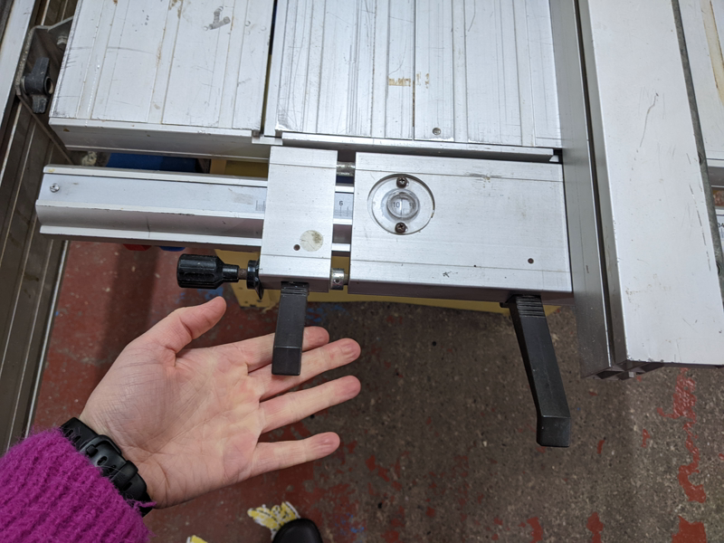 

You can then make small adjustments using this dial:

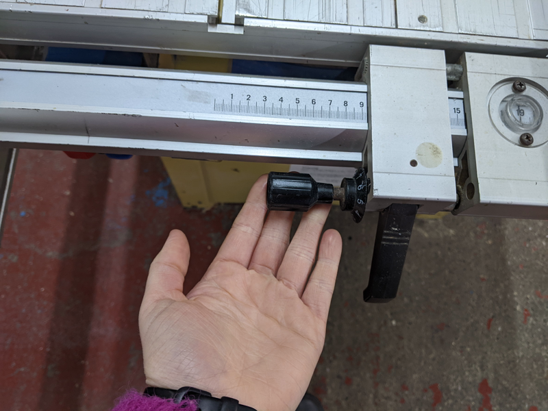 

Finally, secure it in its final position, using this lever:

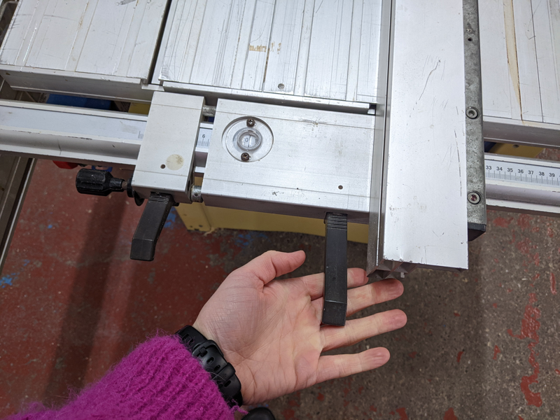 

To take it off to use the crosscut fence, simply release both levers and lift it off the table.

To put the crosscut fence onto the table, you need to align the rail with the wheels on the bottom of the fence. You
also need to pull and twist out this stopper to ensure the fence can slide on properly. Once you have slid the crosscut
fence onto the table, pull and twist the stopper so it slides back in. This will ensure that the fence doesn't roll back
and off of the bench. 

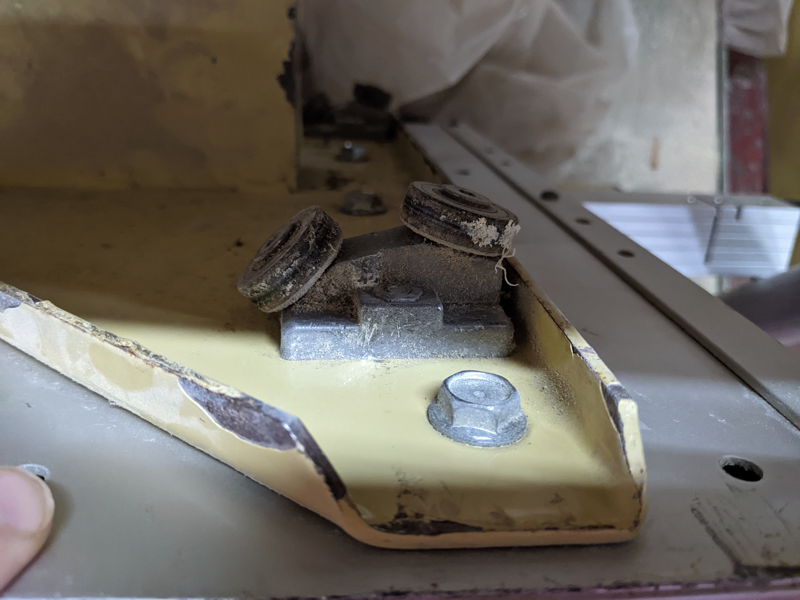 

This is how the fence slides:

### Starting/stopping the saw

To switch the table saw on, first you must turn this dial to the on position (after putting in the code you received after your induction).

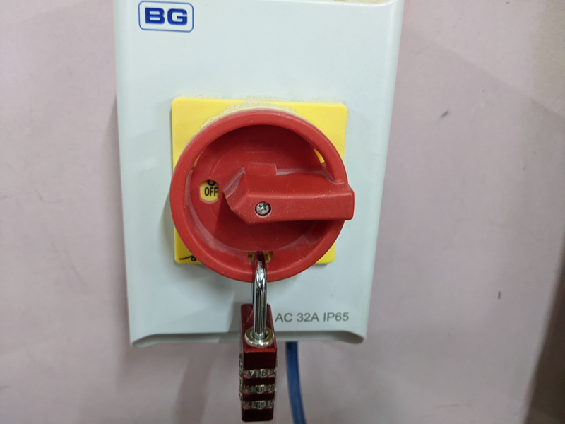 

The saw plugs in like this:

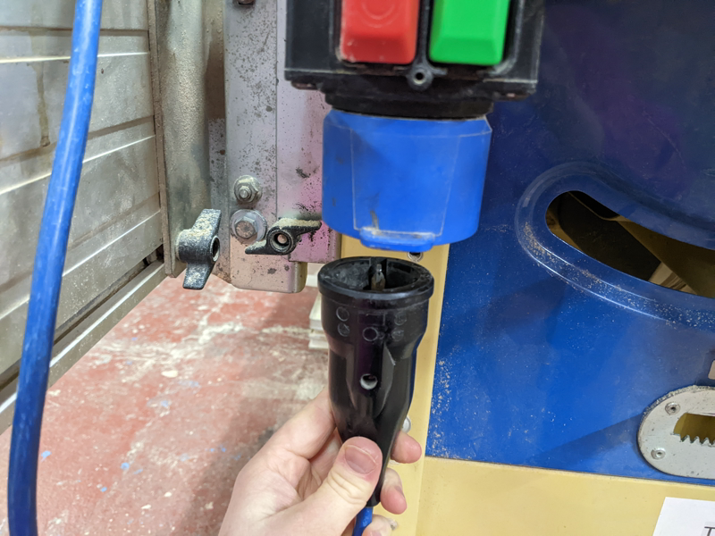 

Then you can use the start and stop buttons to switch it on:

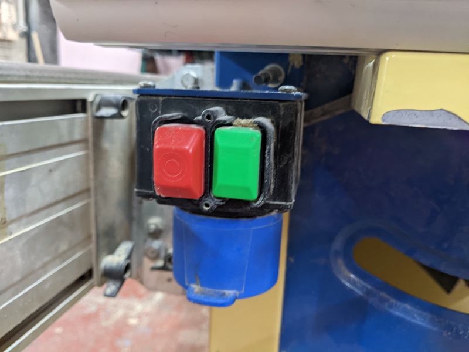 

### Preparation for cutting

Before cutting a piece of wood on the table saw, ensure it is planed and has a straight edge you can place against the fence.

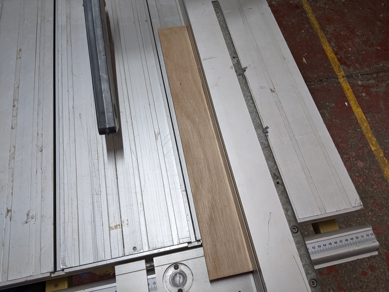

Ensure it can easily slide under the crown guard (otherwise it will cut stuck halfway through your cut). 

Ensure you are holding it securely, with your body to the side (so that, if kickback does occur, the wood will not hit
you). Use a push stick to push the wood through at the final part of the cut (you should always keep your hands more
than 15cm away from the blade). 

#### Blade teeth in good condition

Before use, check the blade is in good condition. To do this, make sure the machine is switched off and unplugged. Then,
spin the blade around to ensure there are no notches or pieces missing from the blade.

#### Blade straight

Ensure that the blade and the ripguide are aligned. To do this, raise the blade to its maximum extent and measure the distance between the
ripguide and the blade at the front and the back of the blade.

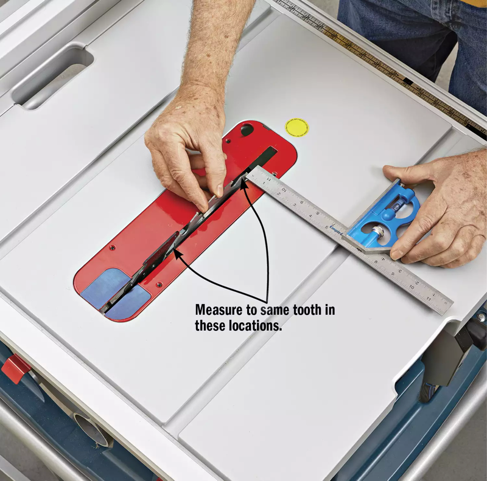
