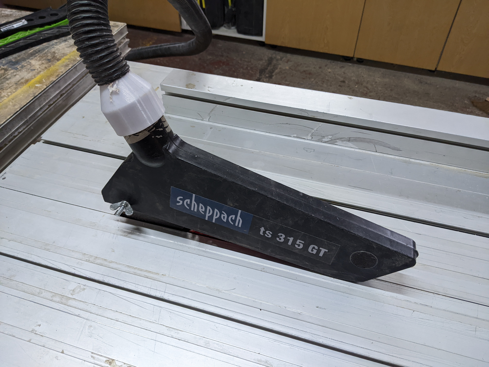
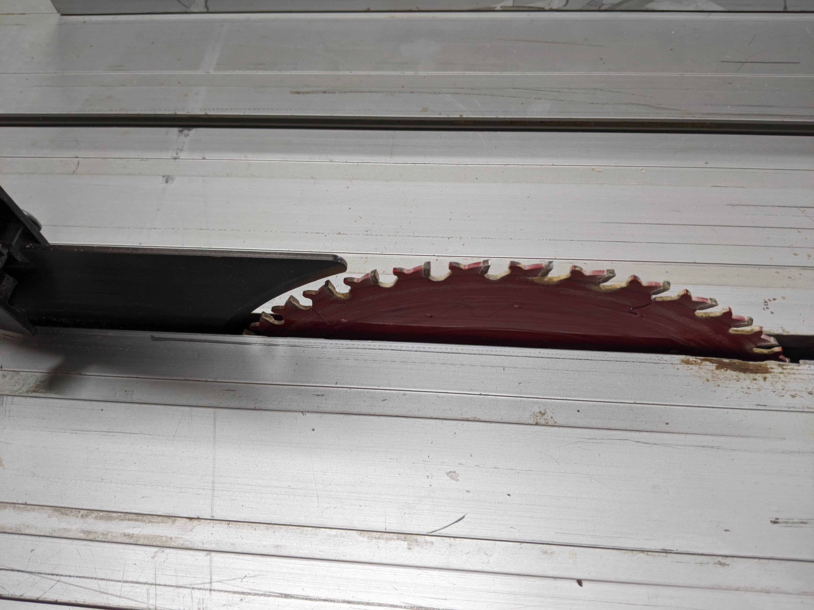
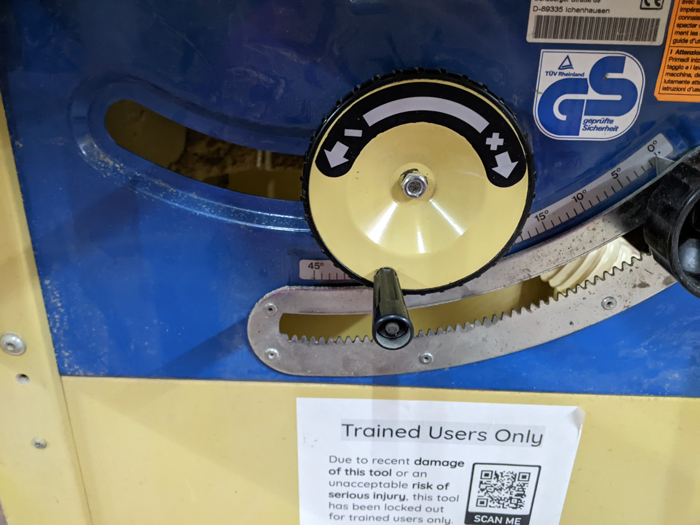
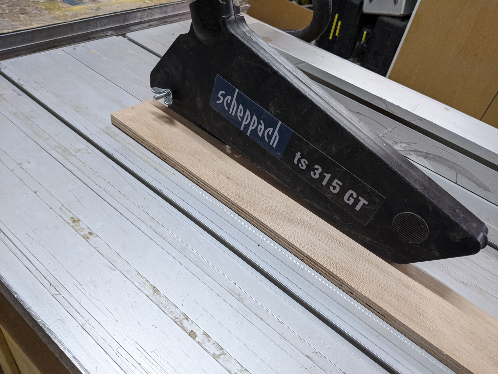

# Table Saws

## What are they for?

Cutting accurately and precisely on planed wood with a flat edge

## Controls

### Crown Guard
This is a crown guard:

The crown guard is there to protect fingers and to protect the user against kickback. While some cuts may need the crown guard to be removed, you should keep it on whenever possible as this is the safest way to use the saw.

If you need to remove the crown guard, you can do so by unscrewing the wingnut and lifting it up and off the blade:

### Blade height

The blade should be high enough to go through the wood but not excessively high. You adjust the blade height using this dial. :

When you've got the blade at the height you want it, ensure that the wood can slide under the crown guard comfortably.

### Blade Angle

A table saw can be used to make angled cuts. To adjust the angle of the blade, you use this dial:

PICTURE

Loosen the screw on the dial, and you will be able to move the dial to the required angle. Ensure that the crown guard is removed when you do this.

### Rip Fence and Crosscut Fence

This is a rip fence:

PICTURE

This is a crosscut fence:

PICTURE

The fence you use for your cut depends on the direction of your cut in relation to the longest side of your wood. The fence should always be supporting the longest side of the wood. 

For this cut, you would use the rip fence:

DIAGRAM

For this cut, you would use the crosscut fence:

DIAGRAM

The rip fence is the standard fence. It should be on the table saw when you come to use it and, if you remove it, you should put it back when you're tidying up after use. To position it, you simply slide it closer and further away from the blade. 

To secure it, first push down this lever:

PICTURE

You can then make small adjustments using this dial:

PICTURE

Finally, secure it in its final position, using this lever:

PICTURE

To take it off to use the crosscut fence, simply slide it off the bench.

To put the crosscut fence onto the bench, you need to align the rail with the wheels on the bottom of the fence. You also need to pull and twist out this stopper to ensure the fence can slide on properly. Once you have slid the crosscut fence onto the table, pull and twist the stopper so it slides back in. This will ensure that the fence doesn't roll back and off of the bench.

PICTURES

This is how the fence slides:

### Starting/stopping the saw

To switch the table saw on, first you must turn this dial to the on position (after putting in the code you received after your induction).

PICTURE

The saw plugs in like this:

PICTURE

Then you can use the start and stop buttons to switch it on:

PICTURE

### Preparation for cutting

#### Check material is correctly located and secured

Before cutting a piece of wood on the table saw, ensure it is planed and has a straight edge you can place against the fence.

PICTURE

Ensure it can easily slide under the crown guard (otherwise it will cut stuck halfway through your cut).

PICTURE

Ensure you are holding it securely, with your body to the side (so that, if kickback does occur, the wood will not hit you). 

Use a push stick to push the wood through at the final part of the cut (you should always keep your hands more than 15cm away from the blade).

#### Blade teeth in good condition
Before use, check the blade is in good condition. To do this, make sure the machine is switched off and unplugged. Then, spin the blade around to ensure there are no notches or pieces missing from the blade.

#### Blade straight

Finally, ensure that the blade and the CAN'T REMEMBER TERM are aligned and straight. This ensures there the wood doesn't get caught on the blade and cause kickback.

PICTURE
