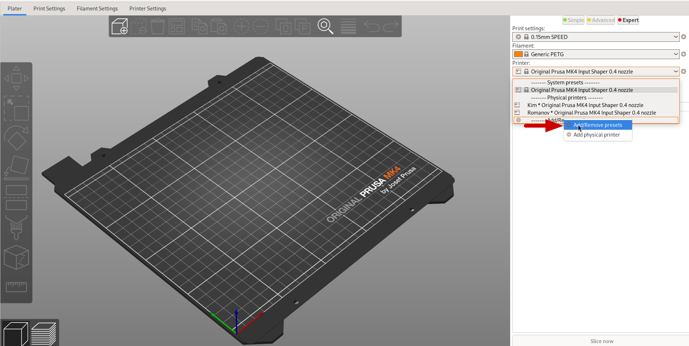
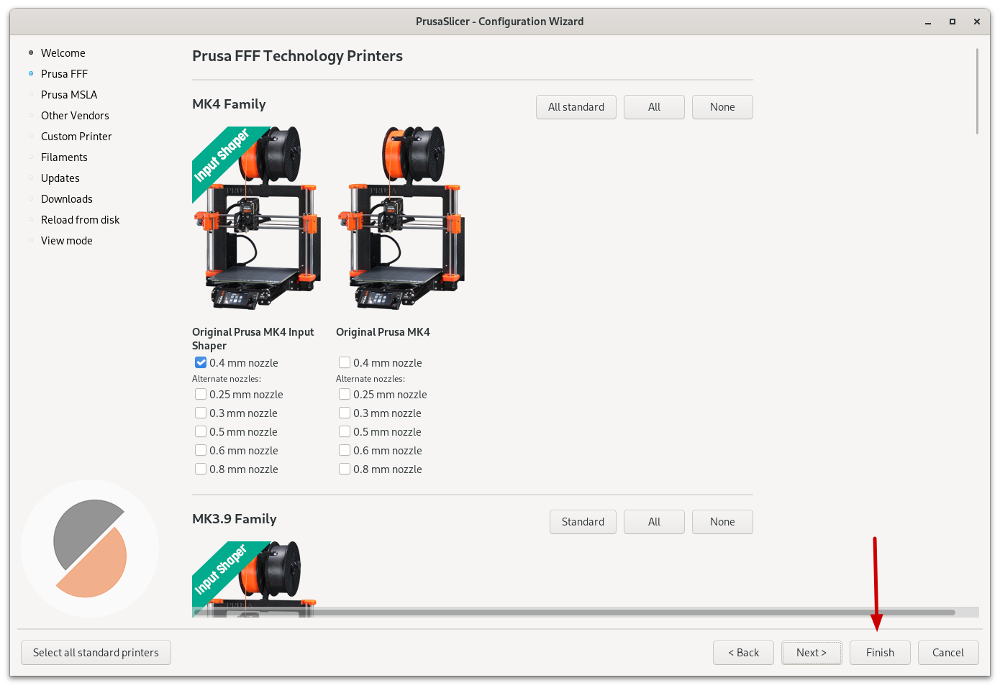
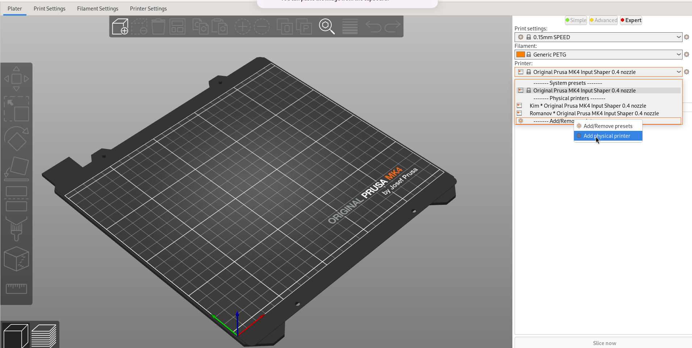
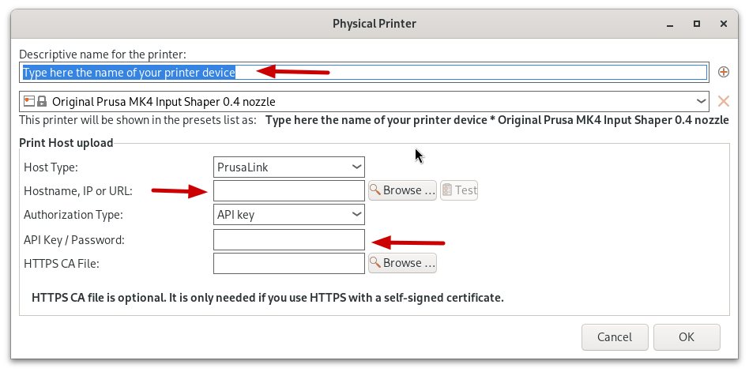
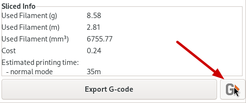
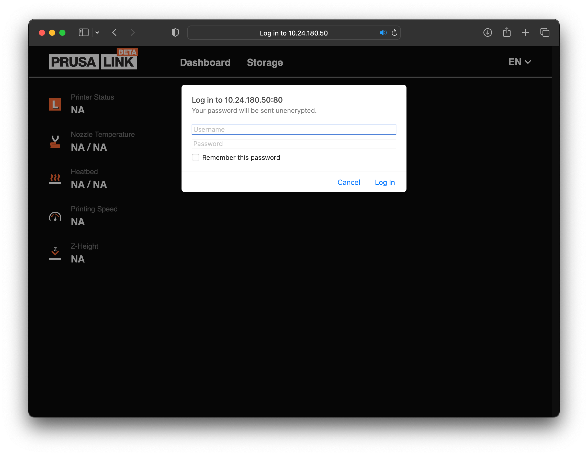

# Prusa Mk4

> There is a manual next to the printers which contains plenty of information on how to use the printers.

## Basic safety information

**Hot Surfaces- 290°C extruder tip, 120°C heated bed**
Careful of hand placement when pre-heated.
Molten plastic present when in use! It will stick to skin! Use a tool to
remove.

**Unexpected motion-Self calibrates**
Tie back hair when using.
Remove jewellery.
Ensure no one is near moving parts before starting a print.

## How to setup the MK4's **with** PrusaSlicer and print

Download [PrusaSlicer](https://www.prusa3d.com/en/page/prusaslicer_424/?)

---

Click "add/remove presets""

---

Select MK4 with or without [Input Shaping](https://help.prusa3d.com/article/input-shaper-mk4-xl-mini-_451816)

---

Press "add physical printer"

---

Then add in the following details

| Name    | IP-Address   | Prusa-Link Key  |
| ------- | ------------ | --------------- |
| Kim     | 172.16.0.123 | dmAPJnhhJ37VXBV |
| Romanov | 172.16.0.124 | JZXE4a9SUKAKWEw |

---

### Printing from PrusaSlicer

Pressing the button next to "export g code" will send your file to a physical printer, if it doesn't work make sure you have a physical printer selected and not a generic preset.

## Using the Prusa's **without** PrusaSlicer

It is perfectly fine if you want to use the Prusa's with a different slicer or [custom G-code.](https://fullcontrol.xyz/)

Simply visit the IP-Address from Printer Connection Information to use [PrusaLink.](https://help.prusa3d.com/guide/wi-fi-and-prusalink-setup-mk4-mk3-9-xl-mini-_413293#416077)

Use "maker" as the username and the Prusa-Link key as the password.

| username | IP-Address   | Prusa-Link Key  |
| -------- | ------------ | --------------- |
| maker    | 172.16.0.123 | dmAPJnhhJ37VXBV |
| maker    | 172.16.0.124 | JZXE4a9SUKAKWEw |

---

## Changing filament

To UNLOAD previous filament:

1. Navigate to Filament → Unload filament, and confirm selection,
   Printer will preheat, and filament will be ejected once temperature
   reached.
   

2. Once ejection complete, remove the filament by hand and wrap the
   spool up properly for the next Maker.

To LOAD filament:

1. Place a filament spool on the spool holder,
   

2. Unhook the end, but keep light tension on it,
   

3. Trim the end into a sharp point with cutters,
   

4. Thread the end through the filament guide and into the top of the
   extruder.
   

5. Navigate to Filament → Load Filament and confirm selection.
   

6. Select the material you are trying to Load, and confirm.
   

7. Wait for pre-heat to complete.
   

8. Press rotary knob to start feeding filament, and lightly push the
   

9. filament into the extruder until it starts pulling the filament by itself.
   

10. Wait for printer to stop pulling filament and:
    

11. Confirm if you see your new filament being extruded,
    

12. Purge more if the colour hasn’t fully changed.
