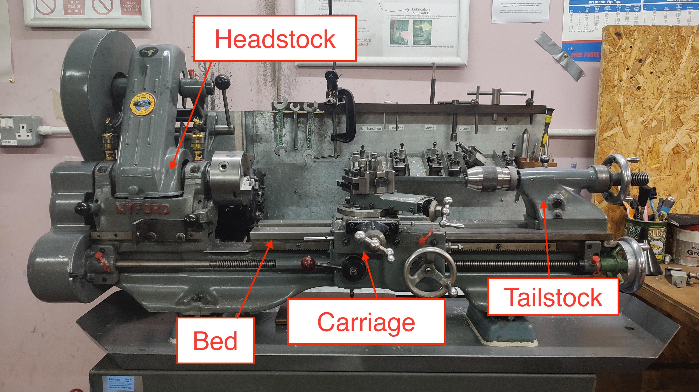
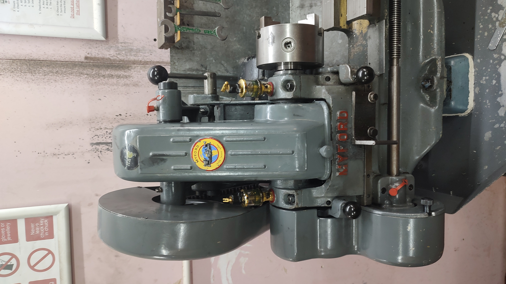
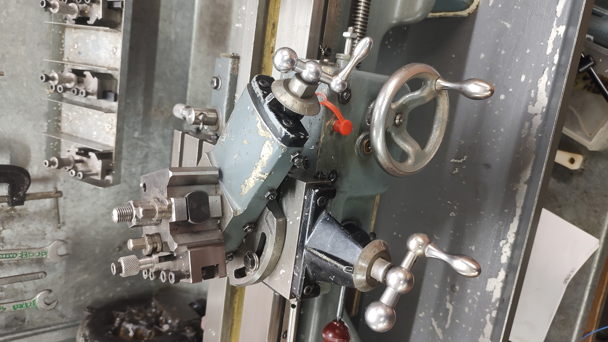
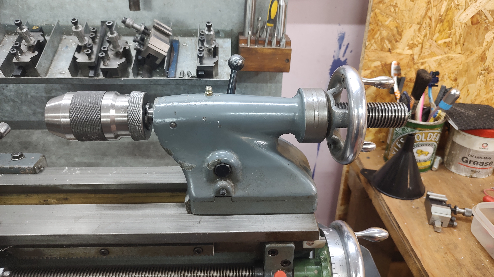
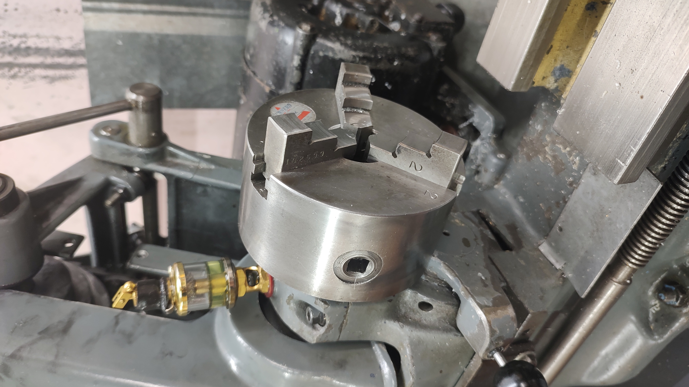
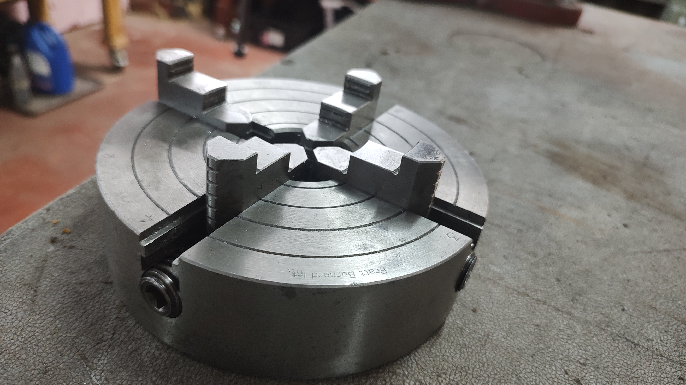
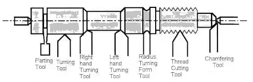
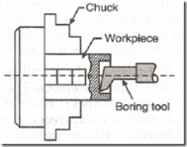

# Metal lathe – info for trainees
Welcome to the HacMan lathe training course.
 
You will learn to use the lathe in a manner that is safe to you, other people, and the machine.
 
After completing the course, you will be able to do some basic operations on the lathe, but it's up to you to learn the more advanced techniques, including achieving good accuracy and good finish on your parts. Your trainer will be able to further learning resources during your in-person session. Good luck and have fun!
 
The course has 3 elements:
 
1. Reading and watching the information on this page (about 1.5h).
2. A brief online quiz to test your knowledge (about 30 minutes)
3. An in-person training session where you will get to use the lathe and make a simple part (about 2h)

## Let’s go
To start, please watch this seven-minute video introducing you to the lathe and lathe safety.

## Clothing and PPE when using the lathes in the space
* Safety glasses are mandatory.
 * Ordinary (vision correcting) glasses are not OK on their own unless they are appropriately rated.
* Long hair must be tied back well out of the way of the lathe.
* Loose clothing must be removed or tied away – long sleeves are OK, but must not be loose
* No gloves should be worn when using the lathe – nitrile gloves are acceptable when lubricating
* Rings should be removed from fingers
* Bracelets and watches should be removed from wrists
* Shoes must be closed-toe
* It is advisable to either wear an apron or clothes you don't mind getting oily

## General safety
The lathe is a very powerful tool. If not used carefully, it can cause serious injury and/or death.
 
At the same time, it is capable of remarkable precision. Maintaining this precision requires careful use.
 
* You must not use the lathe if you are under the influence of alcohol.
* You must not use the lathe if you are under the influence of any drugs that negatively affect your reaction time or judgement.
* You must not use the lathe while fatigued.
* NO LONE WORKING. There must be at least one other person in the space when you use the lathe. They need not be trained, but must be able to, at a minimum, turn off the power and call for assistance.
* Never leave the chuck key in the chuck. If turned on, the lathe will fire the metal chuck key directly at your face with lethal force.
* Never use a file on the lathe without a properly fitted handle.
* Never attempt to touch or adjust parts of the lathe while they are still moving.
* Don't let yourself be distracted while using the lathe.

## About the lathe
The lathe is a machine that allows you to create precisely dimensioned objects – usually round in profile, and usually made of metal. We start with a piece of raw material and gradually remove the material we don't want, leaving behind a part of the desired size and shape.
 
In the Hackspace, we have two working lathes: a Myford ML7 and a Warco 220. This image shows the Myford lathe, but both machines have the same basic configuration.

The major parts we are concerned with are:

### The headstock

An assembly that allows us to hold workpieces securely and rotate them at various speeds.

### The carriage

A collection of moving parts that allow us to move sharpened tools in relation to the rotating workpiece. By moving the tool, we can remove material from the workpiece and obtain the dimensions we want.

### The tailstock

An assembly that allows us to support long workpieces or to perform some cutting and drilling operations.

### The bed
The base of the lathe, which holds the headstock, tailstock and carriage in alignment and allows the latter two to move precisely in relation to the workpiece. The precision-ground surfaces of the bed along which the carriage moves are called the ways or bedways.
 
There are many, many more parts in a lathe, and we will learn more about them during this course. You can find a more detailed description and diagrams of the parts of a lathe [here](http://www.lathes.co.uk/latheparts/).

## Workholding
Using the correct workholding method is important to achieve safe and precise results.

*3-jaw chuck*

Most of the time you will be using a three-jaw chuck. This has a scroll and three interchangeable jaws. Three jaw chucks are suitable for most work on a round or hexagonal bar.

*4-jaw chuck*

If you want to work on square (or irregular) material, you will need the four-jaw chuck. This has independent jaws, and only has one set. You will need to correctly centre your work. The four-jaw chuck can also be used when you want to turn work around, as the three jaw chuck is not perfect.
 
There are other options for workholding, such as a collet chuck, the faceplate, and turning between centres. Your trainer will briefly explain these, but it's up to you to find out what workholding method is most appropriate to your project.
 
When changing the chuck, you must use the protective board to avoid damage to the ways, and you must lift correctly. Your trainer will show you how this is done.
 
Running the Myford lathe backwards may undo the threads on the chuck and cause it to fall off whilst it is spinning. Therefore it can be VERY DANGEROUS. Your trainer will explain more about this during your session.

## Tooling
The lathes have multiple tools of different shapes, allowing you to cut away material. The basic tools you'll need initially are:
 
- A **turning tool**, for making basic cuts along the end and face of a piece
- A **boring tool**, for enlarging holes within a piece. This is held in the toolpost in line with the lathe axis, rather than perpendicular like other lathe tools.
- A **parting tool** – a thin tool which allows you to - cut a groove in a workpiece and ultimately cut it from the main stock
 

Most of the (newer) tools we use regularly use carbide inserts, held into a steel holder with a small screw. Before using them, check that this screw is tight, that they are properly mounted in the toolholder and that the tool height is correct. Your trainer will show you how to check and adjust tool height.
 
If the insert is chipped, it can be turned round, or, if the other side has been used, replaced.
 
All other tools are high-speed steel (HSS), and can be ground to restore the cutting edge. Tool grinding is beyond the scope of this training, but there are plenty of guides online.
 
Whilst they are HSS, please don't let them get too hot – occasionally cool them off in water whilst grinding. Please try not to accidentally grind the toolholders – take the tool out if necessary.

## Basic operations
Now we've got a good understanding of safety and how a lathe works, let's look at some basic operations. These short videos explain the concepts very well. Please watch them all.
 

*Facing (cutting across the end of a workpiece – 07:22)*

*Turning (cutting along the length of a workpiece – 08:03)*

*Drilling (making holes in the centre of a workpiece – 11:32)*

*Parting (cutting your part off the main workpiece once it's done – 30:57)*

This final video is quite long and involved. You don't need to know all the detail about parting tools and their setup in the first 16:26 minutes, but watching it won't hurt.
 
During your session, your instructor will show you how to set the lathe speed and then let you try facing, turning, drilling, and parting off. At the end of this, you’ll have a small machined disc with a hole in it to take home with you.

Now you've learned about the basics, test your knowledge on this short quiz. If you get full marks, you can request your in-person induction.

[Take the quiz!](https://forms.gle/LAxULouwu2tN4Ujd7)
