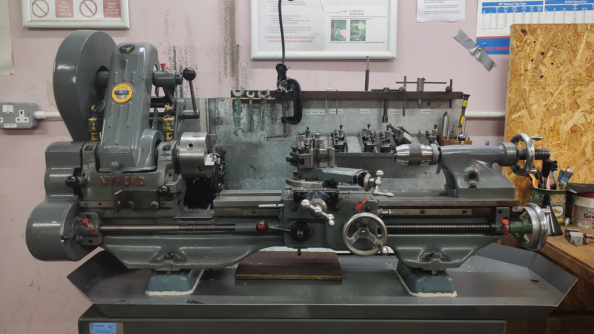
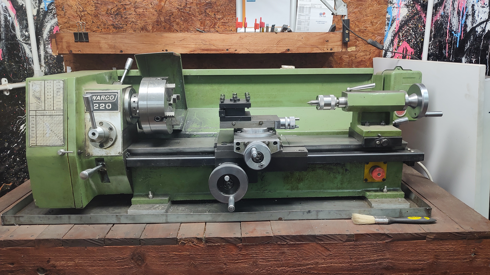
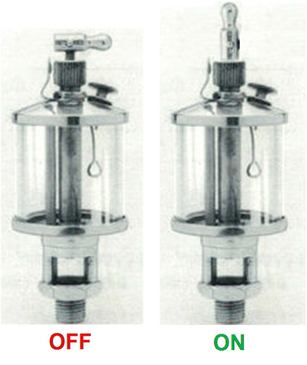

# Metal Lathe

We have two main metal lathes at the Hackspace

Myford ML7

Warco 220

## About

The Myford ML 7 lathe was manufactured in the 1940's as a light
machining and model lathe. The lathe has the space to take a roughly 5"
diameter by 20" length piece of work.

This machine is ONLY for metalwork, and should only be used by people who have been trained.

## Lubrication (Myford)
- When first starting to use the lathe, the oil containers on top need to have the levers on the top put in the upright position to let the oil start to flow. These need to be closed off after you have finished using the lathe by placing them in the laying-down position.

- There are 13 points that should be oiled as required. Most of these have red plastic caps on. Use single pump from the silver oil pump gun to force oil into these points. This is shown during inductions.

- Lubricate the slideways if necessary using the green can.

## Induction

Inductions take place on the Myford. Once inducted, you may use any of the lathes.

The induction has 3 elements:
 
1. Reading and watching the information on [this page](../../metalwork/Inductions/metal_lathe_induction.md) (about 1.5h).
2. A brief online quiz to test your knowledge (about 15 minutes)
3. An in-person training session where you will get to use the lathe and make a simple part (about 2h)

[To begin, click "Request induction" on this page.](https://members.hacman.org.uk/equipment/metal-lathe-1) Note this only works for members of Hacksapce Manchester.

## Manuals

### Myford ML7

[Myford ML7 manual](../../../instruction_manuals/metal_lathe_ml7.pdf) – purely the basic factory manual.

### Warco 220

[Warco 220 manual](../../../instruction_manuals/Warco-Lathe-220.pdf)

## Risk Assessment

[Metal lathe risk assessment](https://docs.google.com/document/d/1Ckn6wt5Kt5GExF2brg1Ixn9H61BRuLUSmT6GqF7LXkM/edit?usp=drive_link)

## Beginner projects and other resources

The first two videos are from YouTuber Blondihacks, who has an [excellent playlist on lathe skills](https://www.youtube.com/watch?v=H6Dnmd3lDzA&list=PLY67-4BrEae9Ad91LPRIhcLJM9fO-HJyN). If you watch this entire playlist and practice the skills, you'll become a very capable machinist.
