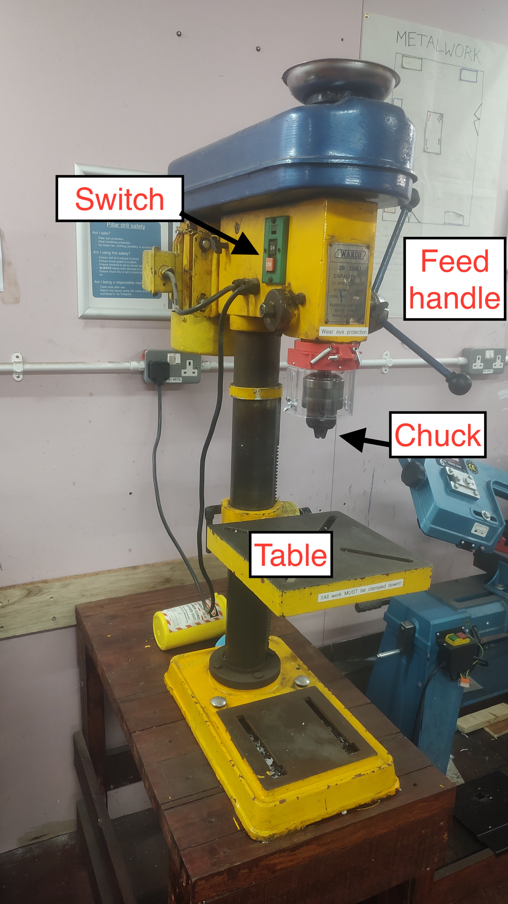
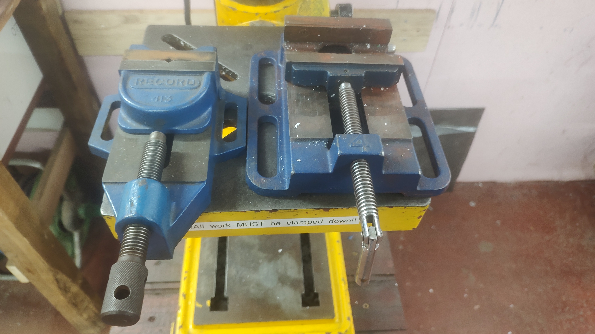
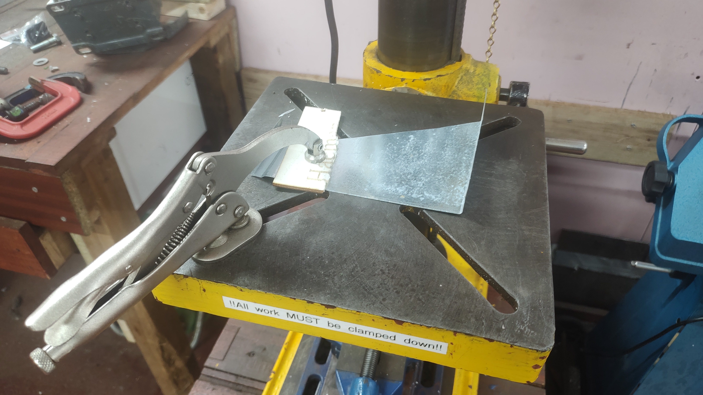
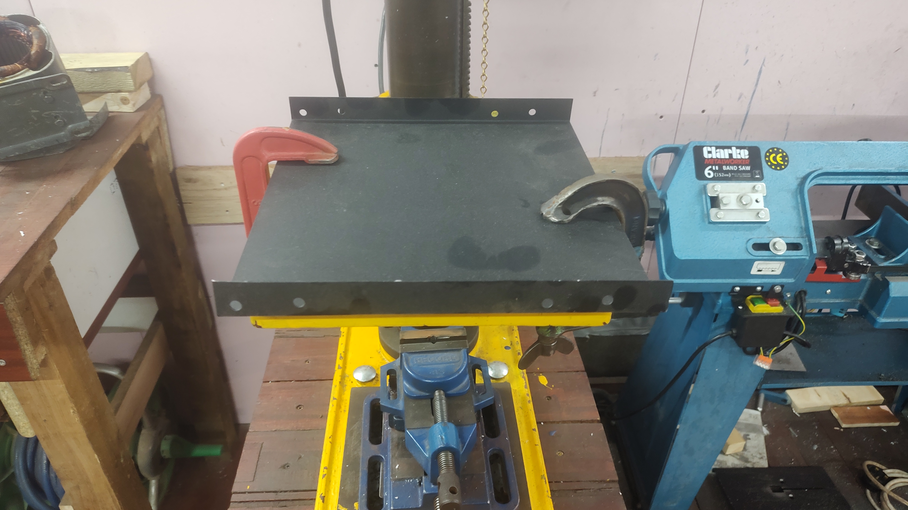
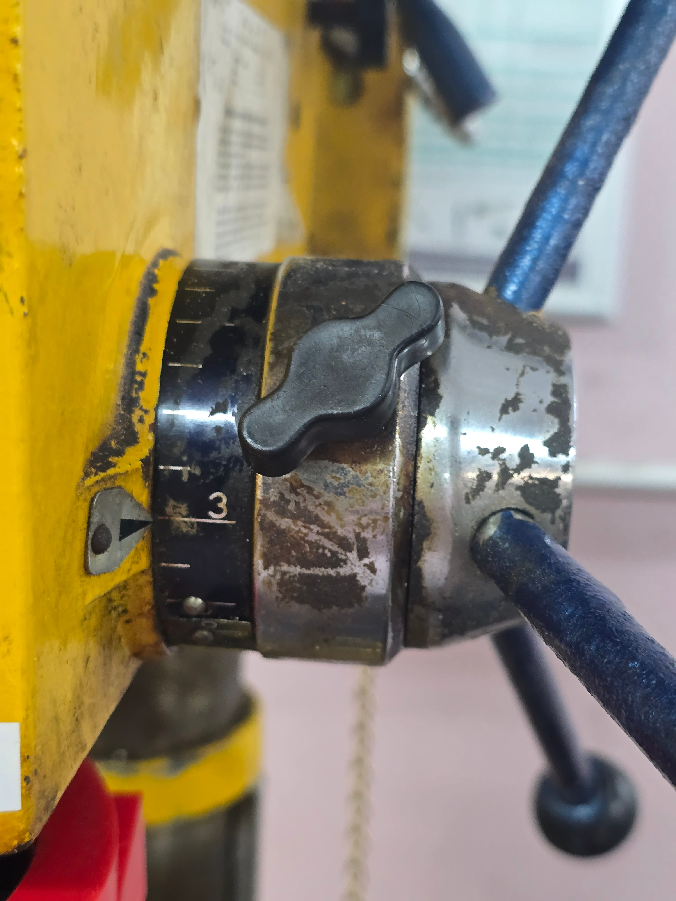
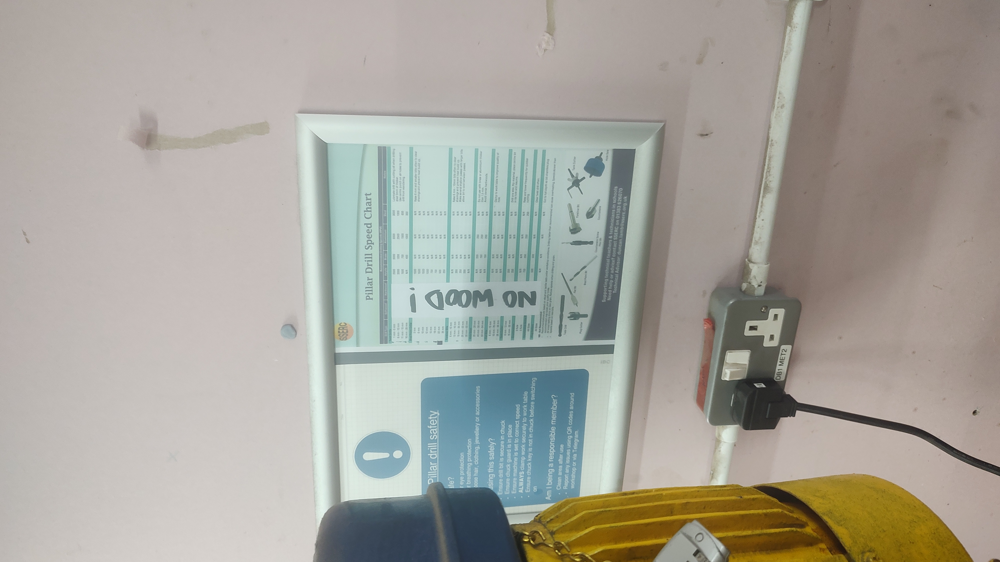
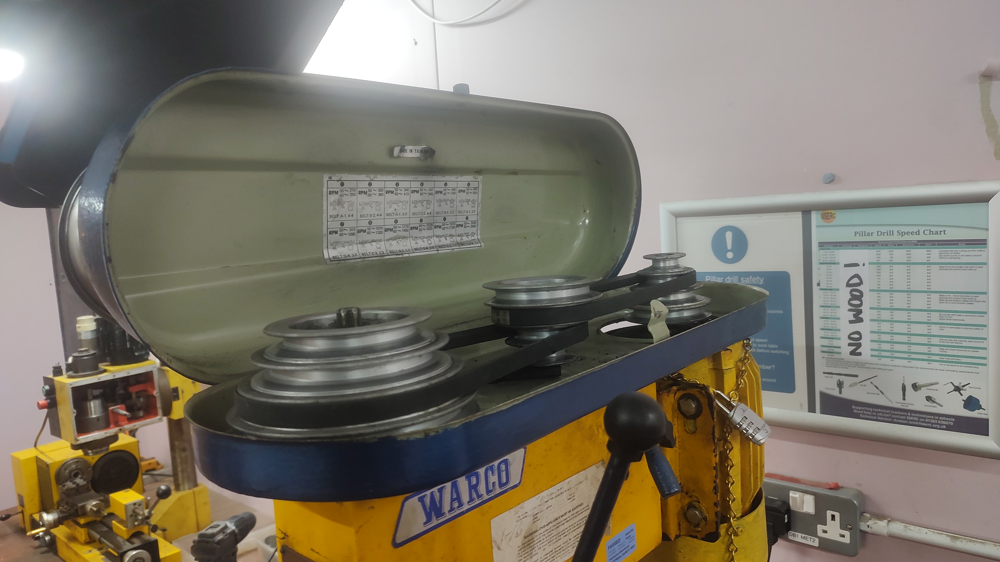
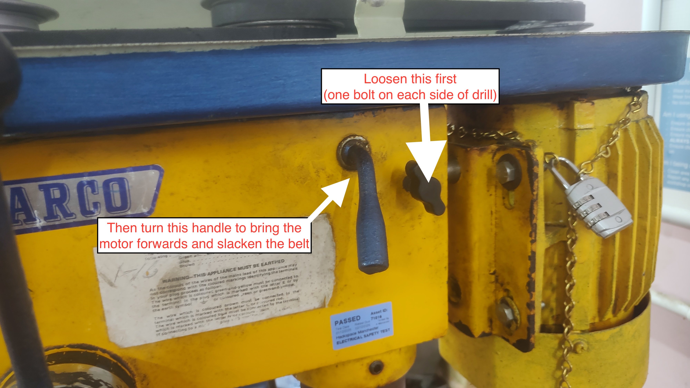

# Pillar Drill

The pillar drill (also known as a drill press) is one of the most useful tools in the workshop. It can drill into metal much more easily than a hand drill, but staying safe and making the most of the tool require some knowledge.

This guide outlines safety principles of the drill and provides some tips.

To use the drill, you will need to pass a short online quiz. This can be found on the [tool page of the members portal](https://members.hacman.org.uk/equipment/pillar-drill) by clicking the *Request induction* button. Read the information here, then take the quiz and follow the instructions to get access to the drill.

## Checks before use
Before you even turn the machine on, check your surroundings and the machine's state.

### Are you safe?
 - **Wear eye protection.** Drilling metal will create small metal chips (called swarf) that are thrown in all directions.
 - **No gloves.** They can become entangled in moving parts.
 - **No loose clothing/hair/jewellery.** This can also be an entanglement risk.
 - **Use hearing protection** if required. Usually, drilling metal does not produce loud noises.

### Is the machine safe?
 - Ensure the table is free of offcuts, oil, or unnecessary tools.
 - Just as when using any tool, check that the cable and machine are in good overall condition.

## Basic functions & setup
 - **Switch:** This turns the drill on and off.
 - **Table:** Can be raised and lowered to accommodate workpieces of different sizes. The crank handle on the right raises and lowers the table, and the lock on the left secures it at that height. 
 - **Feed handle:** Pull the wheel towards you to lower the chuck and drill into the work. Release gently and allow the spring to raise the chuck. Do not let go of the handle!
 - **The chuck:** Insert the bit and tighten all three holes of the chuck with the chuck key. Ensure the bit is centred in all three jaws and not pinched off-centre between two jaws. This will be very apparent once the drill is turned on.   
   
    Always remove the key immediately—it becomes a dangerous projectile if left in. The chuck key is physically chained to the machine, so it cannot get lost.  
      
     The chuck is covered by a chuck guard. This should be carefully flipped up and down when access to the chuck is needed.

### Workholding
Never hold the workpiece with your hands. Use the supplied drill vices, toggle clamps or G-clamps to secure your metal to the table. The vices must be bolted down.
*Note the use of a small piece of wood to provide the necessary packing under the toggle clamp in the second image below.*

 > **Clamping work is not a suggestion – it is mandatory.** Drills frequently “grab” onto metal, especially when breaking through thin sheet. If work it not clamped when a drill grabs, the piece will spin out of your hand, becoming a dangerous, sharp, fast-moving hazard that can badly injure you.

### Depth stop

To set a depth stop, loosen the bolt, slide the ring around to your desired depth, and tighten the bolt back. Our drill is quite old, so this is marked in inches.

### Speed (RPM)
To get a clean cut in metal, you need to match the drill’s speed (of rotation) to the size of hole and the metal you will be drilling into.

Metal requires slower speeds than wood. And larger bits need slower speeds. 

A table providing guidance is installed behind the drill.

Speeds are adjusted by moving belt positions on the pulley under the top cover.

First, loosen the pinch bolts on each side of the drill, then turn the handle to bring the motor forwards. This slackens the belts and allows them to be moved.

Move the belts to achieve the desired speed for your operation.

**Tip:** Belts can be difficult to move. It helps to slip the belt onto smaller pulleys to provide the necessary slack, then “walk” it back onto the larger pulleys while turning the pulleys by hand.

Then you must re-tighten the belt by moving the motor backwards. In most cases, it will only move a few centimetres. Then, tighten up the two pinch bolts again.

## Safe operation and tips
-  **Mark your spot:** Use a center punch to create a small indent in the metal. This prevents the drill bit from "wandering."
- **Start small:** For large holes, drill a smaller "pilot hole" first. 6mm is a good starting size, then work up in 3mm increments. Our drill is not designed for holes larger than about 13mm.
- **The "peck" method:** Apply steady pressure, but frequently lift the bit slightly to break up long, sharp metal shavings (swarf).
- **Coolant:** If drilling steel, use a drop of cutting oil (blue can) to keep the bit cool and prolong its life. For aluminium, isopropyl alcohol can help. These fluids can cause skin reactions, so you can protect your hands with nitrile gloves when applying, but remove them when actually operating the drill.
- **Watch out for hot parts:** Drill bits and workpieces can get hot. Be careful when handling and use tools (e.g. pliers) if required.

## Emergency procedures
- **Snagging:** Metal drill bits frequently “grab” the work. This is especially common when breaking through sheet metal, so clamping work down is mandatory 100% of the time.   
  
  If the drill bit grabs the metal and starts spinning the workpiece, do not grab it. Step back and hit the stop button.
- **Power failure:** In the event of a power failure, the drill will stop running. **YOU MUST TURN THE DRILL OFF AT THE SWITCH IF THIS HAPPENS.** If you do not, the drill will restart as soon as power is restored. This could startle a user, or even worse, cause an injury if a user is touching or near the machine – especially if it happens many hours later.
