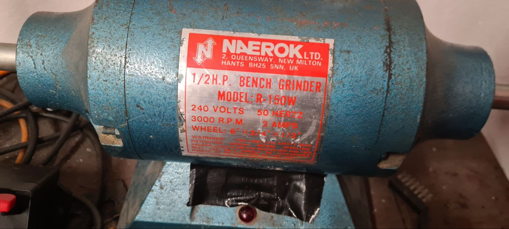
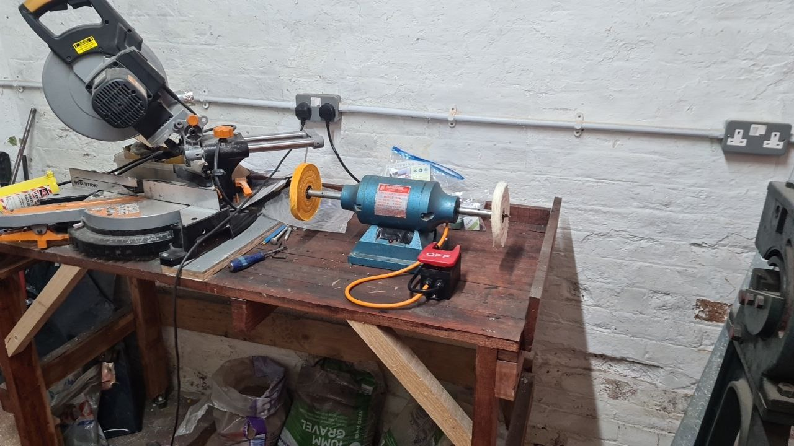
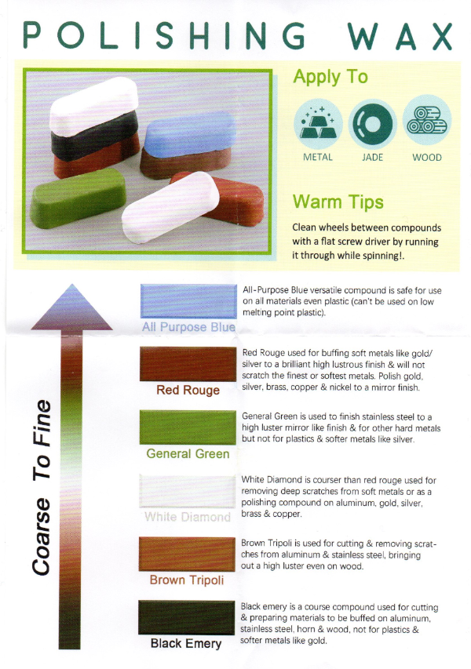
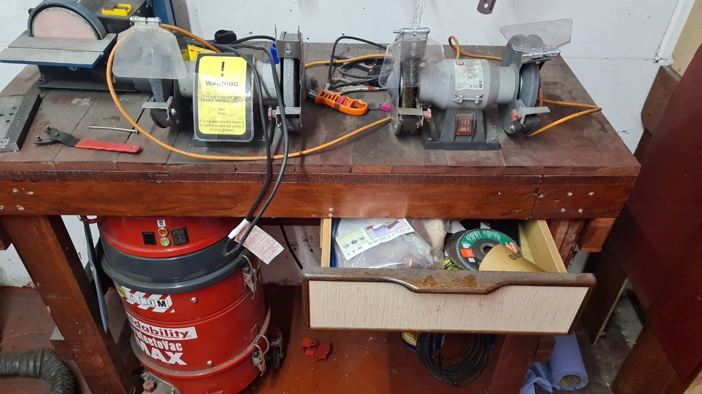
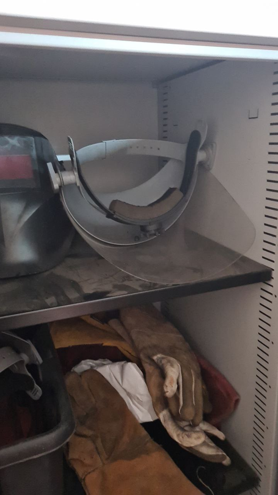

# Polisher

The polisher is a 1/2HP Naerock benchgrinder with two wheels attached.  

  * 240V / 3A / 3000 RPM
  * The type of wheels listed as compatible on the label is 6" x 3/4" x 1/2"
  * This is 6" Diameter, 3/4" thick with a 1/2" Arbor

## Wheels

There are two wheels mounted a white one which is softer and a yellow one which is harder.  
One approach is to apply the polish using the yellow one, then buff it out with the white one.  
To remove polish from the sheels use a flat bladed screwdriver.

  * [https://www.amazon.co.uk/dp/B08SWKQV83](https://www.amazon.co.uk/dp/B08SWKQV83)

## Polish

There are several polish types based on they're color.

  * [https://www.amazon.co.uk/dp/B09BFHT8YW](https://www.amazon.co.uk/dp/B09BFHT8YW)

Currently they're being stored in this draw along with the spare wheel

## PPE

Make sure to wear a faceguard when using the machine

## Risk Assesment / Training

The training for the bench grinder will cover the training for the polisher.  
Full PPE should be worn which includes a face mask and avoiding wearing loose clothing.  
this is due to the potential risk of something catching and being flown across into someone's face if let go.

TODO Waiting on Risk assesment form of the bench grinder from Mike.
