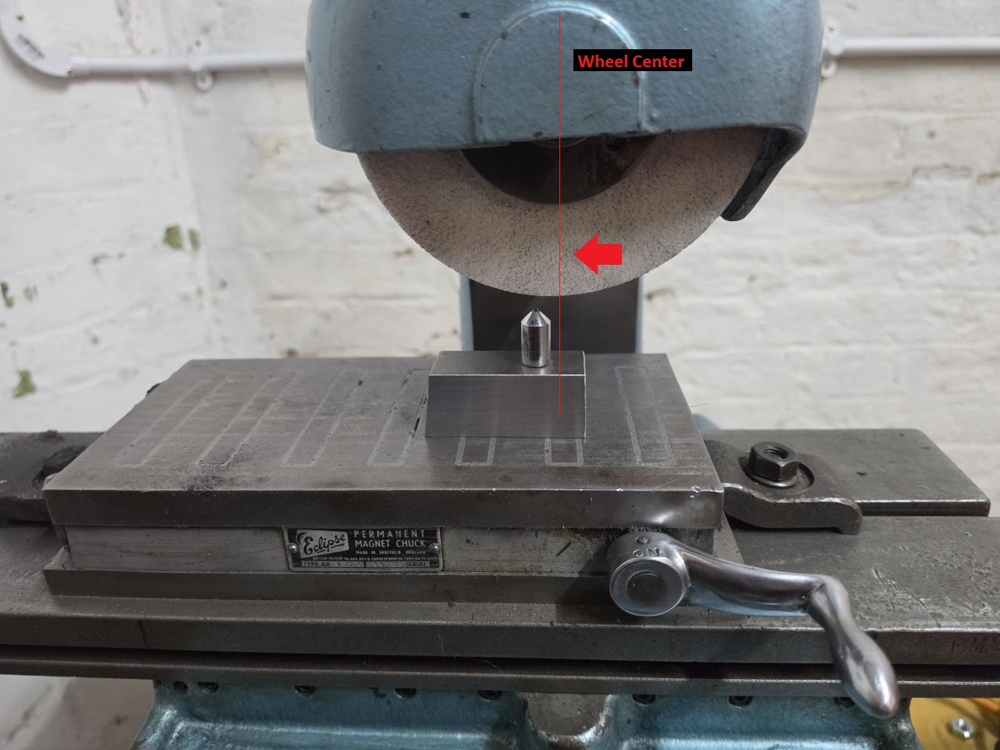

# Dressing the Wheel

Dressing the wheel is usually necessary after the wheel is changed.  
The idea is to get a consistent round surface so that the wheel is not cutting intermittently

/// admonition | Important
    type: warning

It's important to have the dressing bit **BEHIND** the wheel.  
The wheel itself turns in a clockwise motion.  
If the dressing bit grabs we need to make sure it's not thrown into the wheel.  
This could potentially shatter the wheel.

///

