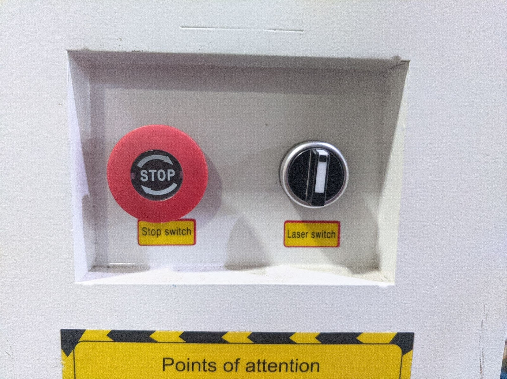
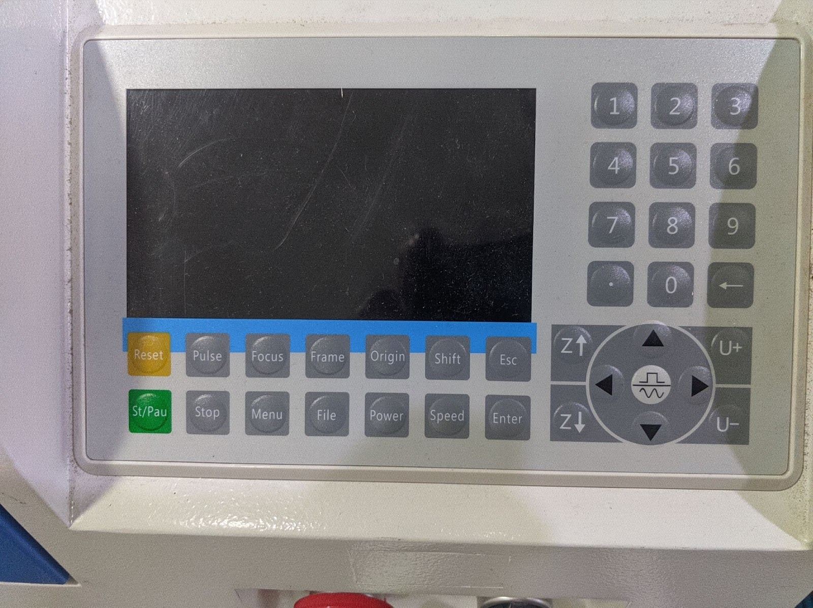
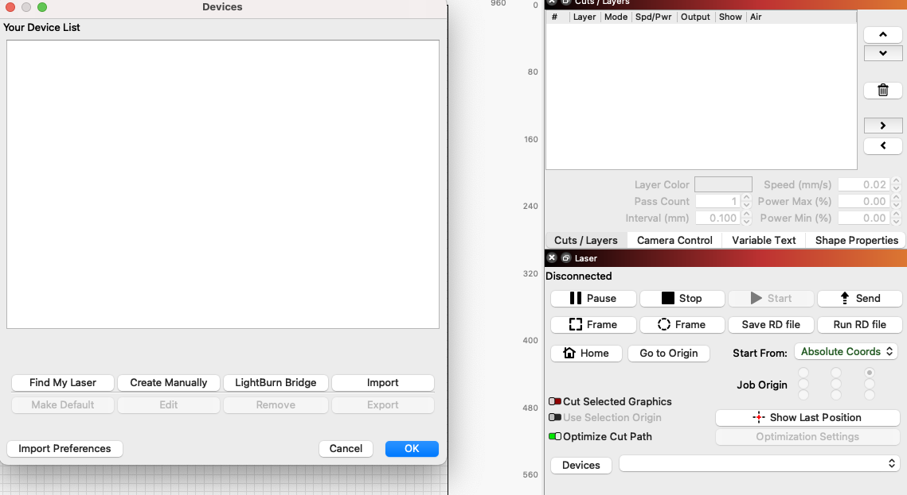
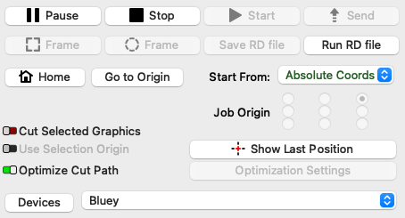
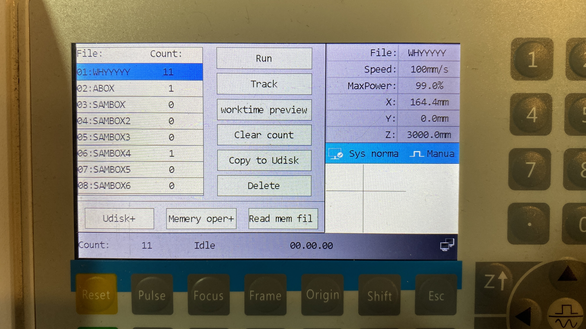

# Laser Cutter

The Laser Cutter (Bluey) is usable by members who have had an induction.

## Safety

> All safety mechanisms of the laser cutter must be checked and confirmed are working and operational before using the laser.
> 
> - Check chillers, lid interlocks, machine panels, extraction or any other feature or mechanism of the machine designed to keep members safe.
> - The coolant pump *must* be running before cutting starts. This is a metal box under the laser cutter which has a two-digit temperature display when switched on.
> - Leave the coolant pump on for at least 5 minutes after cutting finishes.
> - Fume extraction must run while the laser is cutting. This starts automatically when the laser is working. If the extraction doesn't appear to be working, stop cutting.
> - Stay close to the laser cutter and watch it at all times when it's cutting. Fires can start very quickly.
> - Don't use the controls if someone is doing something on the bed
> - If you think a tool is unsafe or behaving in a way it shouldn't;
>   - Mark it out of use and alert the responsible team by the quickest means possible!
>   - Do not attempt to use the tool or allow anyone else to use it.

### In the event of fire / emergency

* There is an emergency stop button on the front that is functional, this will turn everything off and is recommended as a power off switch. The turn switch will just stop the laser firing as well as opening the lid.
* If there is a fire you can safely fight it use the CO2 extinguisher available next to the laser
* If you can't do either of these, leave the space immediately, and call 999. The address is Wellington House, Pollard Street, Manchester, M40 7FS

### Problems other than fires

**DO NOT ATTEMPT TO FIX THE CUTTER YOURSELF.**

If the laser cutter does **anything** out of the ordinary please make sure it's reported to a laser maintainer. 
This can be done through the laser cutter telegram channel.
If the response is "please put the out of order sign on the cutter" then do that. **DO NOT ATTEMPT TO FIX THE CUTTER YOURSELF.** 
If it is clearly not functioning, put the out of order sign on it and then report it. We will fix it as soon as possible.

Even if the laser cutter didn't work, let the chiller run for 5 mins before turning off.

## Materials that can be used

|  Material Class  | Material |  Hazard Status | Potential Hazards  |  Special Notes | Suppliers  |
|---|---|---|---|---|---|
| Wood  |  Laser-grade MDF | 
 **Potential Risks** 
 | Increased risk of fire on multiple passes  | Makes the laser filthy which makes it harder to use and reduces the lifespan of parts - preference is for users to not use this material unless it's necessary  | [Fred Aldous](https://www.fredaldous.co.uk/) 
 [Kitronic](http://kitronic.co.uk) 
 [Hobarts](https://hobarts.com/) |
| Wood  | Standard MDF  | 
 **Banned** 
  | 	Chemical off-gassing, laser damage  | Glues use formaldehyde, which is both carcinogenic and damaging to the laser  |   |
| Wood  | Laser-Grade Plywood - Birch Ply  | 
 **Low Risk** 
  |   |   | [Fred Aldous](https://www.fredaldous.co.uk/) 
 [Kitronic](http://kitronic.co.uk) 
 [Hobarts](https://hobarts.com/)  |
| Wood  | Laser-Grade Plywood - Poplar Ply  | 
 **Low Risk** 
  |   |   | [Fred Aldous](https://www.fredaldous.co.uk/) 
 [Kitronic](http://kitronic.co.uk) 
 [Hobarts](https://hobarts.com/)  |
| Wood  | Laser-Grade Bamboo  | 
 **Low Risk** 
  |   |   |   |
| Wood  | Standard Plywood  | 
 **Banned** 
  | Chemical off-gassing, laser damage  | Glues use formaldehyde, which is both carcinogenic and damaging to the laser  |   |
| Wood  | Balsa wood  | 
 **Potential Risks** 
  | Potential for combustion, smoldering  | Pre-soaking with water may be safer - requires a high level of vigilance while cutting/engraving  | [Fred Aldous](https://www.fredaldous.co.uk/)  |
| Wood  | Paper  | 
 **Potential Risks** 
  | Potential for combustion, smoldering  | Light paper can easily become tinder. While etching is 'kindof' possible, it more leaves a carbon dust behind rather than impacting the paper. Cutting is functional and works well.  |   |
| Wood  | Card/Cardboard  | 
 **Potential Risks** 
  | Potential for combustion, smoldering  | Channels in cardboard can allow for unseen combustion, please cut and engrave with caution  |   |
| Wood  | General Wood (unprocessed/treated)  | 
 **Low Risk** 
 |   | Woods with lower resin content cut and engrave better.  |   |
| Wood  | cork  | 
**Potential Risks**
  | Potential for combustion, smoldering  | Channels and gaps in cork can allow for unseen combustion, please cut and engrave with caution, pre-soaking with water may be safer  |   |
| Plastics  | Thin Polypropylene sheet (<1mm)  | 
 **Low Risk** 
||||
| Plastics  | Acrylic AKA Perspex  | 
 **Low Risk** 
||||
| Plastics  | Foamcore (non-PVC variety)  | 
 **Low Risk** 
||||
| Plastics  | Correx (Genuine non PVC)  | 
 **Low Risk** 
||||
| Plastics  | Depron Foam  | 
 **Potential Risks** 
||||
| Plastics  | Plastics containing PVC (e.g. Sintra, Foamex)  | 
 **Banned** 
  | laser contamination, emissions  | Off-gasses chlorine gas when lased  |   |
| Plastics  | Plastics containing ABS (e.g. 'sheet styrene', Plasticard)  | 
 **Banned** 
  | laser contamination, fire risk  |   |   |
| Plastics  | Polycarbonate  | 
 **Banned** 
  | laser contamination, fire risk  |   |   |
| Plastics  | Polystyrene  | 
 **Banned** 
  | laser contamination, fire risk|||
| Plastics  | Polypropylene  | 
 **Banned** 
  | laser contamination, fire risk, emissions  |   |   |
| Plastics  | HDPE  | 
 **Banned** 
  | laser contamination, fire risk, emissions  |   |   |
| Foam  | PlastaZote Foam  | 
 **Low Risk** 
  |   | Thin material will need weighing/taping down, may cause bounce-back rarely. Engraves and cuts super-well  |   |
| Textiles  | Cotton  | 
 **Low Risk** 
  |   |   | [Abakhan Fabrics](https://www.abakhan.co.uk/)  |
| Textiles  | Hemp  | 
 **Low Risk** 
  |   |   |   |
| Textiles  | Unwashed/Greasy Wool  | 
 **Banned** 
  | Fire risk  | Lanolin in wool can cause fire and smolder  |   |
| Textiles  | Acrylic Felt  | 
 **Low Risk** 
  |   | 'Welds' the edges and can give a fray resistant edge, although this edge can be rough  | [Abakhan Fabrics](https://www.abakhan.co.uk/)  |
| Textiles  | Polar Fleece  | 
 **Low Risk** 
  |   | 'Welds' the edges and can give a fray resistant edge, although this edge can be rough  | [Abakhan Fabrics](https://www.abakhan.co.uk/)  |
| Textiles  | Stretch Cotton Jersey (t-shirt material)  | 
 **Low Risk** 
  |   |   | [Abakhan Fabrics](https://www.abakhan.co.uk/)  |
| Textiles  | Veg Tanned Leather  | 
 **Potential Risks** 
  | Foul odour, emissions, risks with tanning method  | Please check from the supplier that it is specifically vegetable tanned - other tanning processes and ingredients can be harmful. Cutting leather can also give off foul smells and be highly anti-social - please be aware of this when using the laser, and of your other hackspace members.  |   |
| Textiles  | Leather chrome-tanned, or unknown tanning agent  | 
 **Banned** 
  | Emissions  |   |   |
| Textiles  | Fake Leather  | 
 **Banned** 
  | laser contamination, emissions  | Off-gasses chlorine gas when lased  |   |
| Textiles  | PVC  | 
 **Banned** 
  | laser contamination, emissions  | Off-gasses chlorine gas when lased  |   |
| Ceramics  | Stone  | 
 **Low Risk** 
  |   | Engrave only.  |   |
| Ceramics  | Ceramic tile  | 
 **Low Risk** 
  |   | Engrave only.  |   |
| Ceramics  | Glass  | 
 **Low Risk** 
  |   | Engrave only.  |   |
| Composites  | Fibreglass  | 
 **Banned** 
  | laser contamination, fire risk, emissions  |   |   |
| Composites  | Carbon fibre  | 
 **Banned** 
  | laser contamination, fire risk, emissions  |   |   |
| Metals  |   | 
 **Banned** 
  | Can cause laser damage  |   |   |
| Other  | Food  | 
 **Banned** 
  | laser contamination, fire risk, emissions  |   |   |
| Other  | Body Parts  | 
 **Banned** 
  |   |   |   |
| Other  | Lucy  | 
 **Banned** 
  | laser contamination, safety hazard  |   |   |
| Other  | Fresh Flower Oasis  | 
 **Banned** 
  | emissions  | Contains formaldehyde  |   |
| Other  | Laser rubber  | 
 **Potential Risks** 
  | laser contamination  | Requires immediate cleaning of the laser after cutting - this takes significant time, and takes the laser out of service until its done. Please only do this after consulting with the laser team.  |   |
| Other  | Non-Laser Rubber  | 
 **Banned** 
  | laser contamination, fire risk, emissions  |   |   |
| Other  | Flexible Magnetic Sheet  | 
 **Banned** 
  | Emissions (HCl)  | If you find a supposedly laser-safe version, please contact the laser maintainers for approval  |   |
| Other  | Asbestos (all types and products)  | 
 **Banned** 
  | Laser Contamination, H&S  | Someone asked, so we had to put this entry in  |   |

## Checklist for induction - Trainers Guide to Laser Cutting

This is a checklist of items to run through but the more detailed version is below

### Showy Steps

1. Introduce the laser cutter and point all the functions i.e. the bed size, where the cooler is, the extractor fan, menu selector
2. Make sure the coolant pump is on (mention recommended temp [25 or below] and it should come on automatically if the laser cutter is on)
3. Talk about the emergency stop, water, fire extinguisher, fire alarm and when you should use them
4. Open the cover. Mention the different parts, laser head, mirrors, lid switch for laser cut off (don't tamper with safety features)
5. Autolevelling and manually moving the bed with bluey (note the limit switch and how a material should be placed for it)
6. Talk about the menu and briefly mention what the buttons do but go into detail when demoing a cut. They don’t need to go into settings
7. Pop open the bottom panel and show they can clean it out
8. Mention the materials we supply and what materials are allowed
9. Talk about the blue log book and money box. Mention the credit recording at the back of the book
10. Mention why it's worth recording the time even if you don't care about how much money you pay
11. Point out the offcuts pile

### Demo Steps

11. Move to the computer. Prep a job (make it as small as possible) and send it to the laser cutter to show how lightburn works
12. Show making a simple vector image with engraving and cutting a shape. Normally a shape with a cut, mark and engrave
13. Power settings for these are in the cover of bluey notebook
14. Mention the different options in lightburn and how you can manually tweak the settings
    1. [Origin - how to set it](https://docs.lightburnsoftware.com/CoordinatesOrigin.html)
    2. Difference between run and send (just use send for now)
    3. Line and Fill (offset fill is spiral outwards from middle)
15. On the laser cutter, after the job is sent, talk about the checks you want to do before the cut
    1. Position material and focus head
    2. Set origin
    3. Frame test
16. Cut your piece
17. Get them to do the same. I normally get them to draw a shape with a cut, mark and engrave.
18. You have some time while the laser cutter is running to talk about relevant scenarios:
    1. Mention again what to do in a fire
    2. when to use emergency stop
    3. how to report issues with the laser and what issues to look out for
19. Also remind them to record the time of the cut using the laser cutter display
20. Stop the laser with the stop button after a few minutes to allow chiller to run

**Advanced Steps (optional)**

21. Change the speed of the laser cutter to move the head around more slowly
22. Change the speed and power while the job is running. Pause the job and adjust settings
23. Minimum power settings
24. Engraving a jpeg image
25. Offset fill 

## Operating the laser cutter

### Control Panel

* Green - starts whatever job is loaded last or pauses the cut
* Z - raise or lower the bed
* U - rotate the rotary unit (not used)
* Pulse - fires short pulse that can be configured, normally used for alignment
* Focus - Auto level the bed to focus on material (WARNING- make sure your material will touch the push sensor behind the lens)
* Power / Speed - adjust before or during a job
* Origin - Set starting point for job
* Home - sets head back to 0,0
* Reset - restarts controller and zeros temporary values i.e. z height
* Square/Sine wave - sets movement mode continuous or sections (section length needs to be set)

[Video on the features of the ruida controller](https://www.youtube.com/watch?v=l9nPmHXbX1I) 

## Using Lightburn for laser cutting

The PC next to the laser cutter has lightburn installed and it is already licensed.

You can download lightburn from [https://lightburnsoftware.com/pages/download-trial](https://lightburnsoftware.com/pages/download-trial). 

You will need the profile for bluey which is [available here](config/Bluey.lbdev). The profile can be imported through the devices section in the bottom right.

If you want to buy lightburn [this is the license you need](https://lightburnsoftware.com/products/lightburn-dsp) for Bluey.

Hacman have negotiated a discount that gives you 75% off (but if you are using the software with any other laser cutter consider buying a full licence). The code is given on the member page after you’ve passed training.

Note: We do not support RDWorks but that can be an option to use.

### Lightburn

Lightburn is the software that converts vector files into the code that drives the laser cutter.

It has a [great guide here](https://docs.lightburnsoftware.com/index.html) well worth a read, if you want use the laser cutter for advanced techniques.

After you install the software, there is a help screen and then it will invite you to setup a device. [Import Bluey’s config from here](config/Bluey.lbdev). 

Buttons

* Square Frame moves the laser to show a rectangle boundary around the shape(s)
* Circle Frame moves the laser to draw the actual outlines of shape(s)
* Send will send the file to the laser cutter to store in memory
* Start will start the job without storing the file on the laser cutter
* Pause you can pause a job while running (TBC)
* Stop will stop the job and reset the laser head (TBC)
* Save RD File
* Run RD File
* Home
* Origin
* Optimise Cut Path 

### Laser operations in lightburn

Layers and Ordering

Engrave vs Cut

output, show, adjust speed and power

**Origin settings**

* Absolute - cut the shape as it is in lightburn
* User position - uses origin set by laser cutter and displays that in lightburn as a green box
* Current position - like user position but uses whatever position the laser is in at the moment i.e. not the origin set by the laser cutter

### Positioning the part

Focus button for auto levelling or manually level bed with Z buttons.

Set the origin point using the laser cutter control panel (if needed)

* For cutting materials up to 6mm it's best to have the z height set to bed level.
* For cutting materials over 6mm, try to keep the z height 6mm into the material. Multiple passes may be needed.
* For engraving set the focal point to the height of the material by placing the guide on top of it.
* If you want crisp engraving on thick stock, you will need to do a 2-stage engrave / cut with the focal point initially set to the top of your material, and then re-set to the correct height for your cut.
* If your material has a protective cover, try to leave the cover on both sides of the material, or if only one side the bottom (not the top)

### Test the Laser positioning

Next we're going to do a boundary test to make sure the laser cutter is working on the area we think it's going to:

* Send the job from lightburn or use the frame buttons in lightburn
* Press frame on the laser cutter
* This can be done with the lid open to assist in placing your part, however please keep your hands/hair/ties out of the way of the moving parts.

### Do the cut

At this stage you should now be ready to do the cut for real.

* Send the job to the laser cutter
* Make sure the lid is closed, The laser won't fire with it open.
* Check the coolant pump is still working and the temperature is below 25.
* On the screen select the job and hit start
* Keep watching the laser while it cuts to check nothing goes wrong (e.g. fires)
* Check the extraction fan is working (you can tell either by the noise it makes, or by vibration of the exhaust hose).
* Make a note of the time at the end of the job in the log book
* Turn off laser cutter after 5 minutes

### Logging and payment

* There is a blue log book for keeping track of usage of the laser. Please write down your name and the length of time you've used the laser for in the front of the book.
* The laser is currently billed by 10 minute or 1 hour increments, with the rate written on the laser cutter.
* Laser fees can be paid in cash into a box near the laser, using the payment terminal in the snackspace or from your member balance at[ the members' system laser page](https://members.hacman.org.uk/equipment/laser).
* If you owe the laser fund money or have some credit (e.g. have paid with a £10 note and only used £3) record your balance at the back of the log book.

(insert picture of time elapsed screen and blue book)

### Things to not worry about

* Pulse
* U+ or U-
* General settings

# Laser details

Our laser is the [hl-1060](https://hl-yeah.com/product/hl-1060-100w-co2-laser-cutting-machine-reci-w2-laser-engraving-machine/)

Top-level specifications:

    950mm x 580mm usable area (but bed is bigger)
    90W rated (100W Peak) Power
    Cutting speeds up to 50mm/s
    Engraving speeds up to 400mm/s
    Resolution ratio >=1000dpi
    Awesome Extraction
    Air Assist
    Red-dot laser for bounds checking
    Smart cooling
    Rise-and-fall bed, Super useful for engraving stuff on stuff
