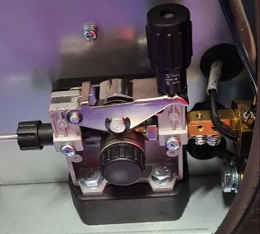
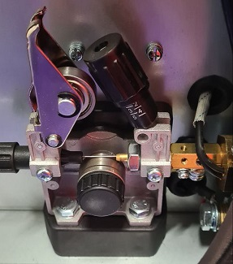
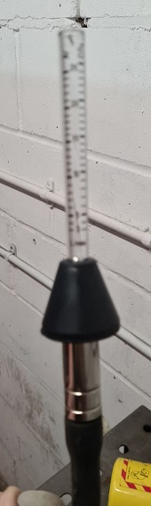
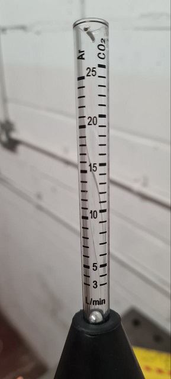

# Calibrating the Flow Rate

One of the ways we can test the flow rate of the gas through the welder
is the use of a peashooter gas flow meter that fits onto the end of the nozzel

  * [https://www.amazon.co.uk/dp/B06XW8H8W1](https://www.amazon.co.uk/dp/B06XW8H8W1)

The typical flow rate for Mig should be around 15-20 litres/min
Our current reading is 19

## Disengaging the wire feed

In order to avoid wire being fed from the Mig nozzel
We need to disengage the wire feed.  
(Make sure the machine is off while doing this)

### Before

### After

## Measuring the the Flow

To measure the flow place the meter upright on the end of the nozzel and depress for gas while in Mig mode.

