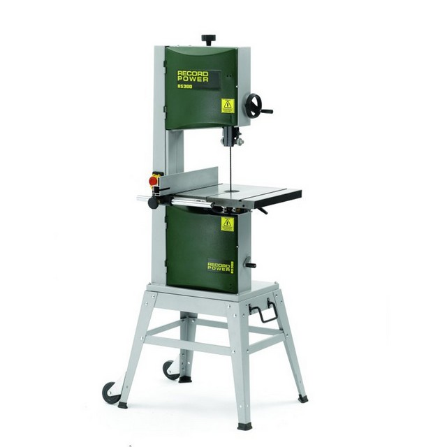
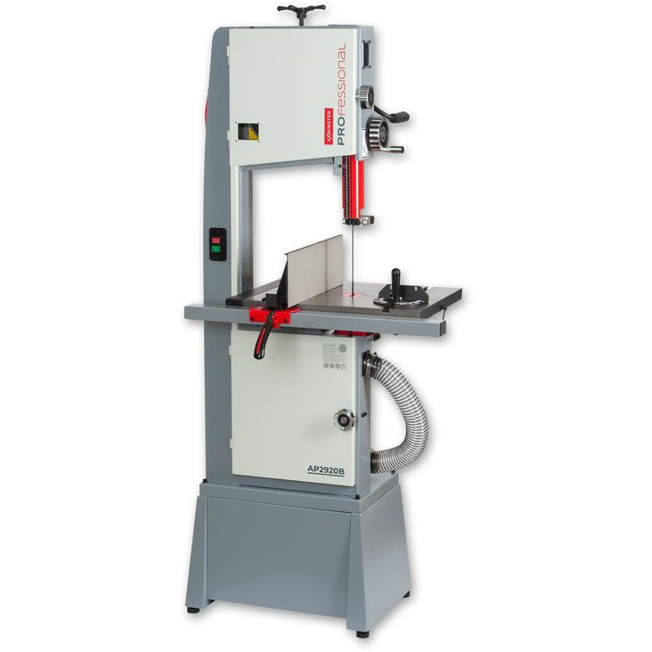

Bandsaws
========

|                 | Record Power                 | Axminster                       |
|-----------------|------------------------------|---------------------------------|
|                 |  |  |
| Model No.       | BS12                         | AP2920B                         |
| Location        | Woodwork, Freestanding       | Woodwork, Freestanding          |
| Training        | Induction                    | Induction                       |
| Lone Working    | No                           | No                              |
| Materials       | Wood                         | Wood                            |
| Blade Length    | 2240mm (88")                 | 2920mm (115")                   |
| Min blade width | 6mm                          | 3mm                             |
| Max blade width | 15mm                         | 19mm                            |
| Blade speed     | 820m/min or 380m/min         | 800m/min                        |
| Max cut height  | 175mm                        | 300mm                           |
| Max cut width   | 185mm                        | 345mm                           |
| Power           | 750W (1HP)                   | 1.5kW (2HP)                     |

### **Manuals**

-	[Record Power BS12](../../../instruction_manuals/bandsaw_green.pdf)
-	[Axminster AWHSBS250N](../../../instruction_manuals/bandsaw_grey.pdf)

### **Training**

Please review the bandsaw training before your induction session. For your induction you will be asked the theory questions and required to demonstrate the procedures in the practical session.

-	[Bandsaw Training](../training/bandsaw.md)
-	[Bandsaw Induction](../inductions/bandsaw.md)

### **Risk Assessment**

[Bandsaw Risk Assessment](https://docs.google.com/document/d/1vmRQARijmAEr8GuRV7vNvCEUal7-j2Tp)
