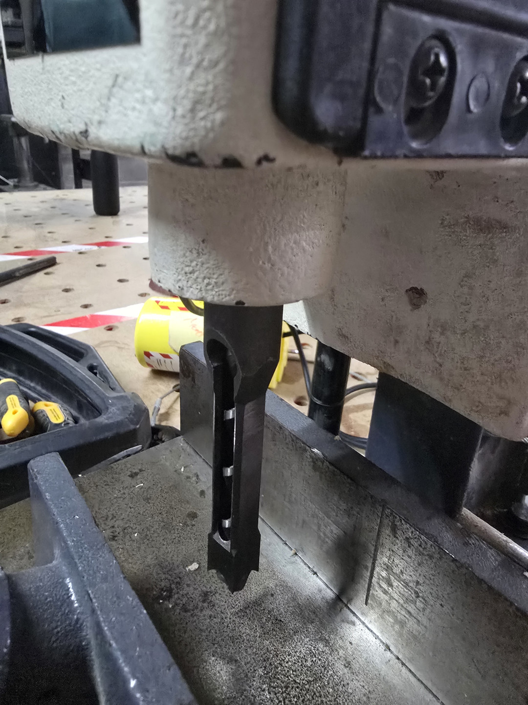
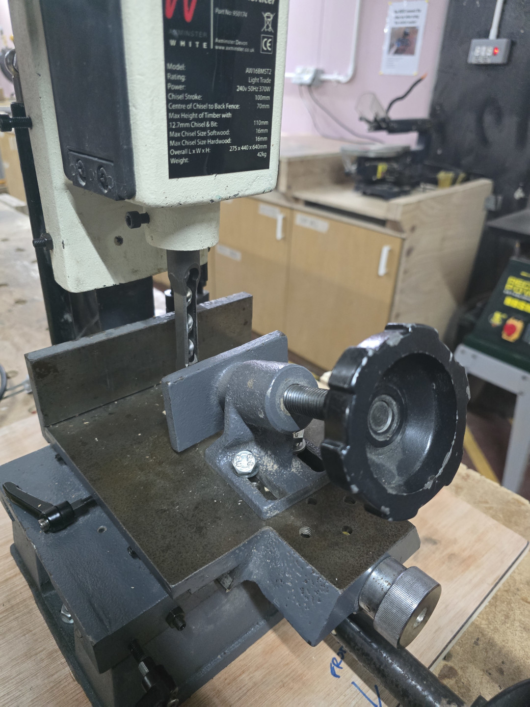
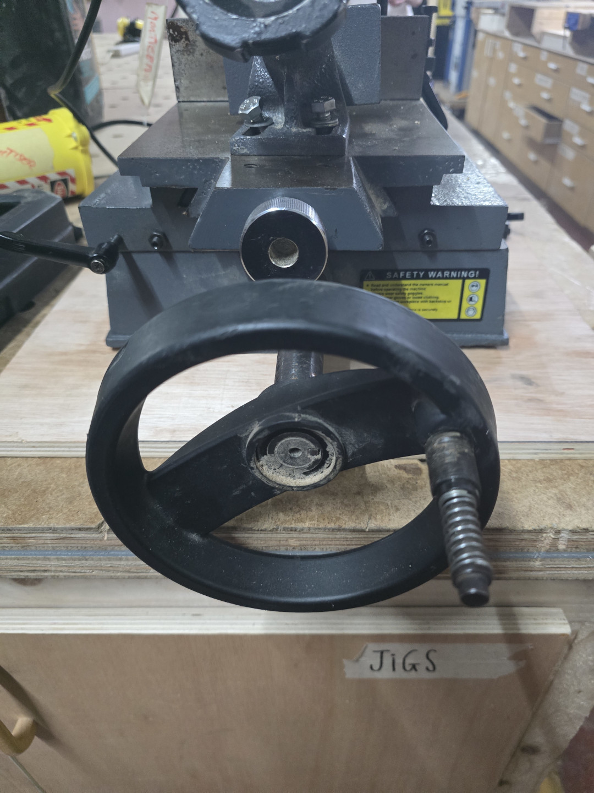
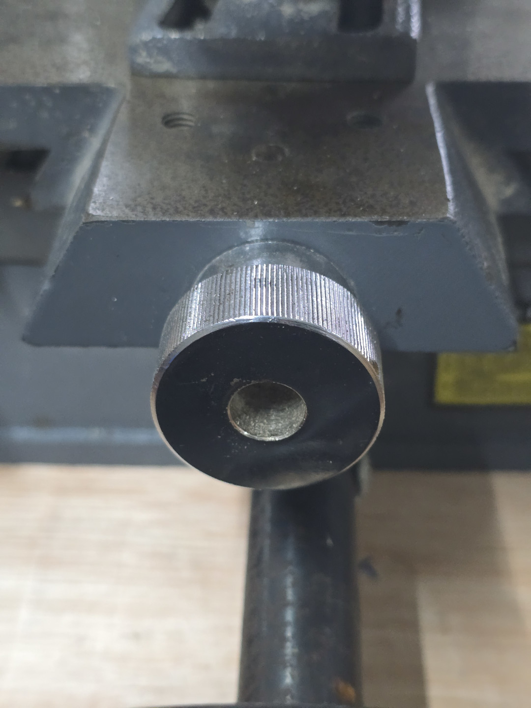
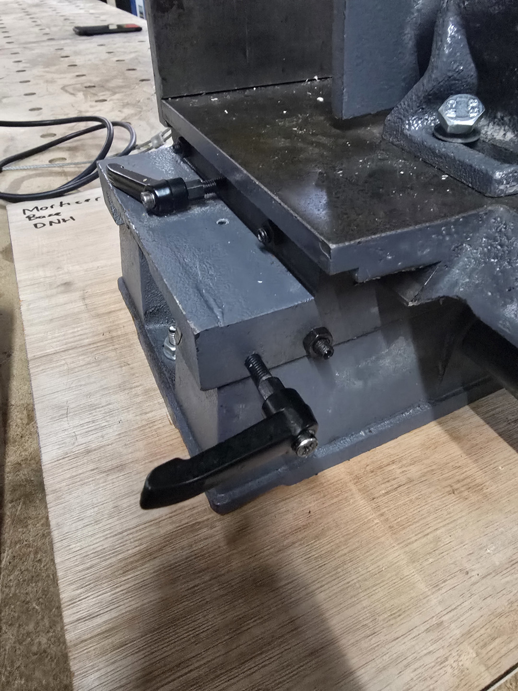
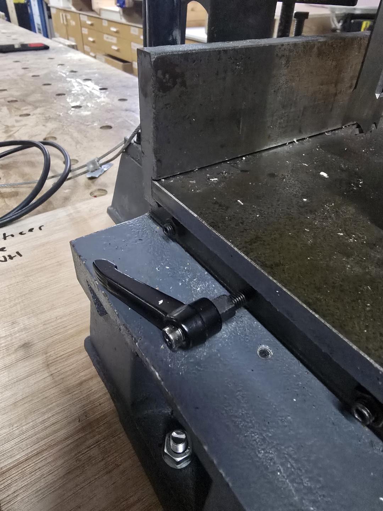
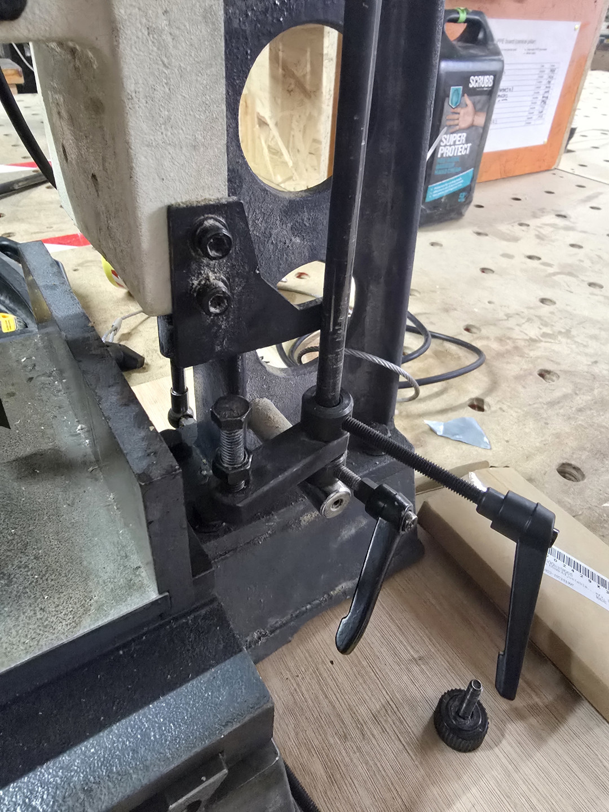
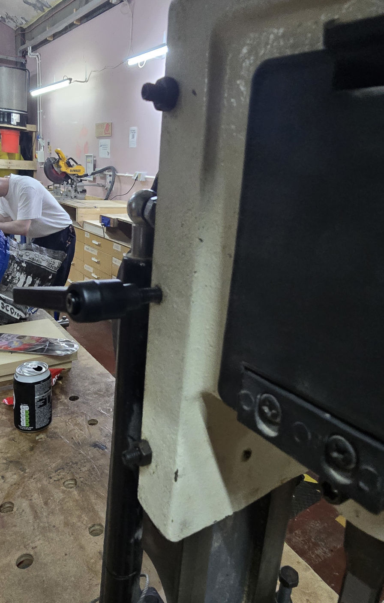

Morticer
=========

|              | Axminsister            			  |
|--------------|--------------------------------------------------|
| Model No.    | AW16BMST2                                        |
| Asset ID     |                                                  |
| Location     | Woodwork, Track saw and morticer cupboard        |
| Status       | Operating              |
| Ownership    |                        |
| Training     | Quiz                   |
| Lone Working | Forbidden              |
| Materials    | Wood                   |

AW16BMST2 Bench Morticer
-------------------

The morticer is similar in function to a pillar drill. There's a large press handle for moving a chisel and bit up and down, held up by a gas piston, to enable cutting square and rectangular slots in your workpiece (known as _mortices_ in carpentry and joinery).

It has an adjustable vice on 2 axes, similar to a milling machine, to enable accurate cutting of longer or wider slots than the size of the chisel will allow.

The large wheel controls the transverse axis (aka left to right, or x), the smaller wheel controls the lateral axis (aka front to back, or y).

There are lever locks on both these axes, they need to be loosened to move the vice into position, and then locked off before use.

There is a depth stop assembly to the right of the chuck behind the vice table. It has an upper and lower stop, and a bolt for fine adjustment.

The chisel and bit can also be changed. We have 3 different metric and 2 imperial sizes stored in the tracksaw cupboard along with the morticer. If you need another specific size for a project you can put a in purchase request or provide your own. The shank needs to fit a 3/4" chuck.

When installing a chisel and bit in the morticer, take care to leave clearance between the end of the chisel and the auger bit. The auger bit is held in the chuck, and the chisel is held with a separate locking bolt below the chuck housing. The manual suggests leaving a 2p coin worth of clearance between the end of the chisel and the tip of the auger. Full guidance and illustration is in the manual linked below.

### Storage

There is a base board in the morticer cupboard that the morticer can be bolted onto, this can then be clamped to the main workbench or one of the side benches. If you're working on a project that requires the morticer, it can be left in position on the workbench with the threaded inserts near the mitre saw. Use the base board which has recesses to provide clearance as the inserts are not quite flush to the surface. When you're finished your project the morticer should be stored in the cupboard under the main workbench marked "morticer / tracksaw". Be aware that the morticer is very heavy, and you might need to ask someone to help lift it. Be aware that the chisel is very sharp, so be conscious of that when lifting. The transverse adjustment wheel extends below the base of the unit, there's a small piece of wood in the cupboard to prop the morticer up so it is not resting on the transverse adjustment wheel.

There is a locking bolt on the side of the motor/chuck housing that allows you to keep the morticer in the pressed position for easier storage.

### Manual

[Morticer - local copy](../../../instruction_manuals/AW16BMST2_bench_morticer.pdf)

### Inductions

Members should complete an online induction/quiz accessed via the [members portal](https://members.hacman.org.uk/).

### Safety

####PPE

-	Eye protection
-	Dust Mask (recommended)

### Risk Assessment

[Morticer Risk Assessment](https://docs.google.com/document/d/1OZOHclDSpSqAgkurJ5x6BwoGHUjrJfPW8WmR8DGtDAY/edit?usp=sharing)
