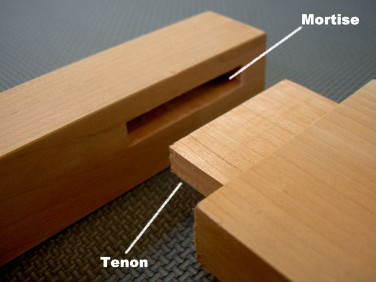

Bandsaw
=======

Pre-requisite training
----------------------

[General](general.md)

What is it for?
---------------

1.	Narrow blade allows very little wastage of material
2.	Blade is perpendicular so can be used to cut mortises etc. 

3.	Material that is not planed

Background reading
------------------

Please read at least the following pages of [technologystudent.com](https://technologystudent.com/equip1/equipex1.htm):

-	[Introduction](https://technologystudent.com/equip_flsh/bandsaw1.html)
-	[Rip fence and Mitre Fence](https://technologystudent.com/equip_flsh/bandsaw5.html)
-	[Basic cutting](https://technologystudent.com/equip_flsh/bandsaw6.html)

Controls
--------

### Record Power BS12

Please see the below demonstration videos for this machine.

[!type:video](https://player.vimeo.com/video/109901699)

Review the [Record BS12 Manual](../../../instruction_manuals/bandsaw_green.pdf) for any further queries

### Axminster AP2920B

Please see the diagram for this machine below. Note in particular that on this model there is a window to enable viewing of the bandsaw's tracking. As this machine has dust extraction always connected and a window for viewing tracking *it is requested users do not open the case*.

The blade guard may be raised and lowered with the

[!img](axminster_anatomy.png)

Review the [Axminster AWHSBS250N manual](../../../instruction_manuals/bandsaw_grey.pdf) for further queries.

Vee block
---------

Use a v-block when cutting round material

This is a simple device that can be homemade which prevents round material from rotating and pulling your hand into the blade. Please watch the video below to see why this is necessary.

Setting the guard
-----------------

Set the guard about 1cm from the top of the material to be cut.

This allows the material to pass through, but gives the maximum protection for your hands. Consider also that the blade may break and in that case it is important it remains inside the machiney break and in that case it is important it remains inside the machine rather than causing injury. The more of the blade is covered by guards, the less risk is posed.
