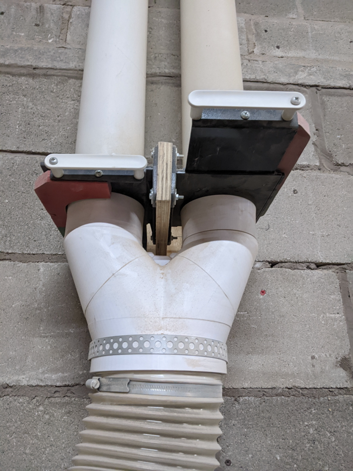
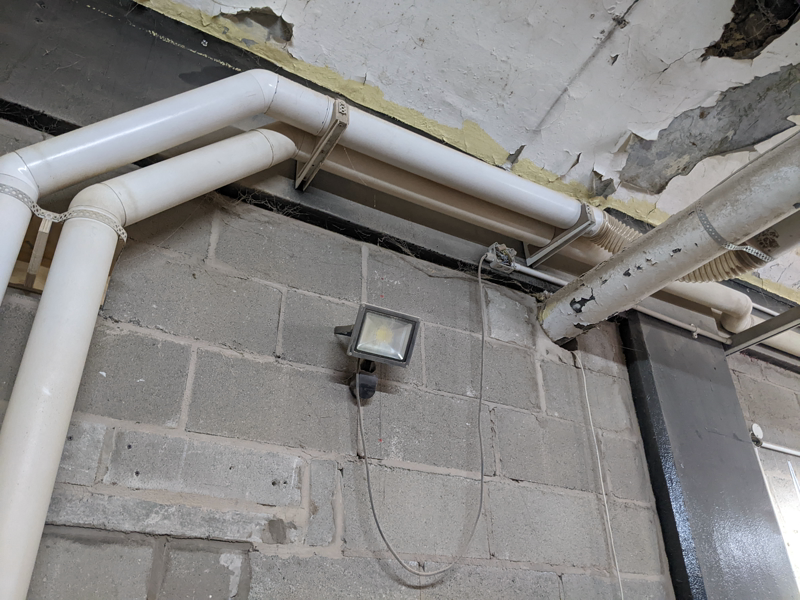
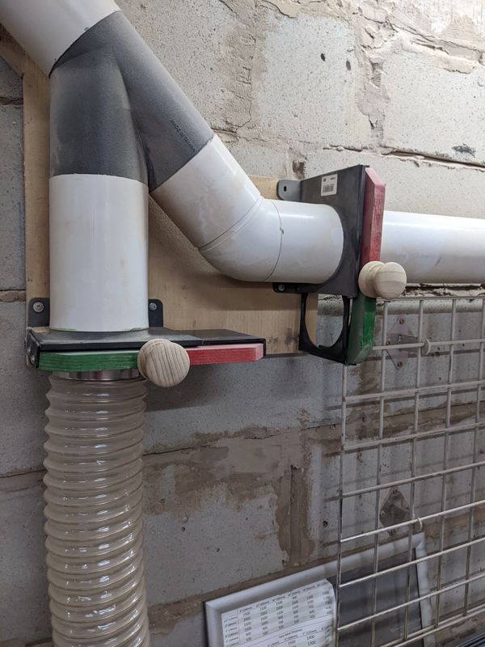
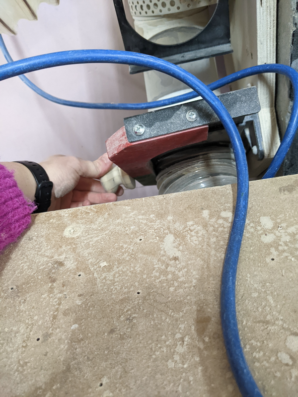
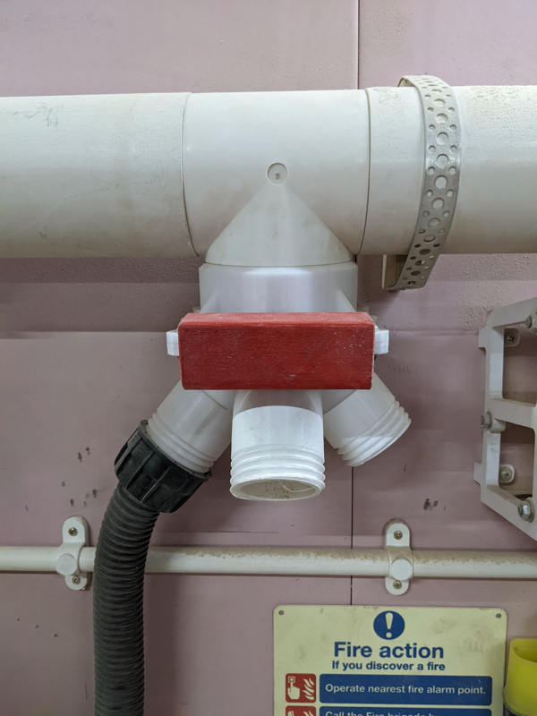
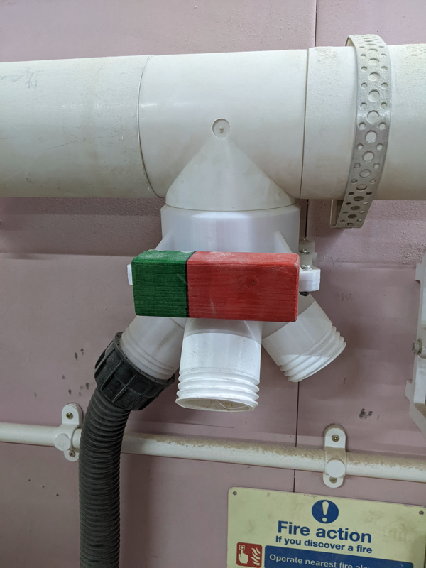
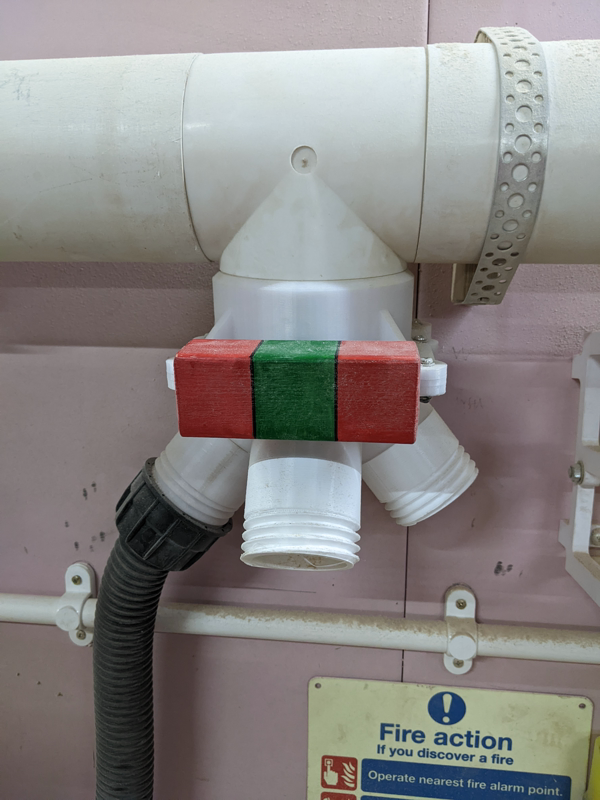

Dust Extraction
===============

What is it for?
---------------

The dust extraction system has been installed to reduce the amount of wood dust in the air and ensure the machines do not get clogged with sawdust.

When should you use it?
-----------------------

You **should** use dust extraction whenever a machine has the capability for dust extraction.

You **must** use dust extraction when operating the following machines:

-	Table saw
-	Planer/thicknesser
-	Bandsaw
-	Router table
-	Oscillating sander

Safety and Useage Notes
-----------------------

-	When using the dust extraction, you must use ear protection
-	You must not use the dust extraction system for metal
-	When using hoses to connect machines to the extraction pipes, ensure they are not trip hazards or blocking exits
-	Extraction should stay on for a few seconds after machine turns off so the dust has time to travel.
-	When the extraction is switched on, ensure at least one gate is open so it isn't trying to pull a full vacuum

Controls
--------

### Switching it on and directing it

The extraction system is switched on using rotary isolator next to the dust extractor.

You can direct the suction to the tool you need through using the green and red paddles provided throughout the space.

### Main branch by dust extractor

There are two central branches from the dust extractor.

You must ensure that the branch leading to the machine you're using is open at this divide. The baffles are colour coded to show whether the baffle is open or closed. Green means open, red means closed. In the picture above, the right hand branch is open. You may open both branches if necessary.

The branches go to different parts of the workshop. They are labelled, but if you are unsure, you can follow the pipes. Here, you can see two branches on the ceiling:

Follow the pipe to the machine you are using and ensure any intermediate baffles are open and baffles for unused paths are closed.

### Branch next to lathe

At time of writing, the branch below goes to either the large bandsaw (down) or to the table saw or the free pipe (to be used for mobile tools). In the picture shown the path to the table saw is closed and the path to the bandsaw is open. Please ensure only one route is open.

The baffles use a simple sliding motion. See the baffle being opened:

and closed

### Branch next to table saw

By the table saw there is one further branch allowing you to select the table saw or the free pipe to be used for mobile tools. Please ensure only one route is open.

### Baffles at individual stations

As well as the larger pipes, the dust extraction also has three way outlets over workstations. The baffles here are similarly colour coded to the larger baffles; but selecting which pipe to use is dependant on placing the required baffle in the slot. Baffles at the station can be pulled out as shown:

You may use these baffles to select a route for the extraction:

#### All pipes at workstation closed

#### Left hand channel at workstation opened

#### Middle channel at workstation opened

