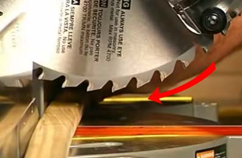

Sliding Mitre Saws
==================

What are they for?
------------------

1.	Cutting precise cuts in beams and narrow boards
2.	Framing etc.

Controls
--------

### Bevel control

#### Evolution mitre saw

#### Dewalt mitre saw

### Mitre control

#### Evolution mitre saw

#### Dewalt mitre saw

### Safety lock (i.e. the second button on the handle to release)

#### Evolution mitre saw

### Start/stop button

### Movable guards

### Preparation for cutting

#### Check material is correctly located and secured

#### Blade teeth pointing the right way

Ensure mitre teeth are pointing towards the back of the machine
