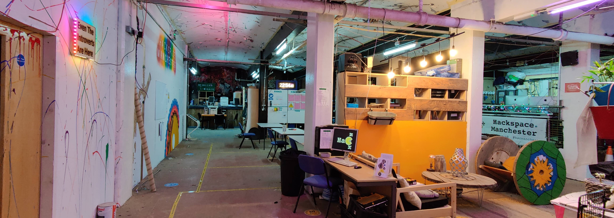

Home
====

Welcome to the Manchester Hackspace Wiki Site!
Here you will find a lot of the information you need to get making in our community.

Like any wiki, this works better when we all make an effort to keep it current, so if you find that something isn't how it is described here, please update the wiki where you can via our [GitHub](https://docs.hacman.org.uk/adding_documentation/), or type up the changes and email it to board@hacman.org.uk and we'll update it for you.

Quick links
-----------

| New Members | How Things Work | Areas
| ----------- | --------------- | ----- |
| [Visit & Join Us](https://hacman.org.uk/visit-us) | [Rules](https://docs.hacman.org.uk/governance/rules/) | [Metalwork](https://docs.hacman.org.uk/equipment/metalwork) |
| [Getting Started](https://docs.hacman.org.uk/getting_started/) | [Storage Rules](https://docs.hacman.org.uk/governance/rules/member_storage/) | [Woodwork](https://docs.hacman.org.uk/equipment/woodwork/) |
|  | [Purchase Proposals](https://docs.hacman.org.uk/membership/buying_stuff/)  | [Visual Arts](https://docs.hacman.org.uk/equipment/visual_arts/) |
|  | [Consumables List](https://docs.google.com/spreadsheets/d/1AOO55t0vs3c4PiPQu42w1USbfekBcNd9CSx9lppWmmY/edit?usp=sharing) | [Welding](https://docs.hacman.org.uk/equipment/welding/) |
|  |  | [3D Printing](https://docs.hacman.org.uk/equipment/3d_printers/) |
|  |  | [Electronics](https://docs.hacman.org.uk/equipment/electronics/) |
|  |  | [CNC](https://docs.hacman.org.uk/equipment/cnc/) |

## Contribute to the docs
[Add and Update this documentation](https://docs.hacman.org.uk/adding_documentation/)
