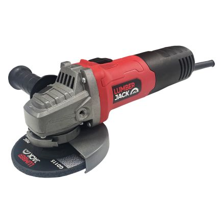

# Angle Grinders

## Lumberjack Electric Heavy Duty Trade Angle Grinder 115mm

| Image                       | Description                                                                                                                                                                                  |
|-----------------------------|----------------------------------------------------------------------------------------------------------------------------------------------------------------------------------------------|
|  | The Lumberjack 820W Angle Grinder is ideal for tackling a range of tasks including sanding, cutting, grinding or polishing, remove rust, grind mortar, smooth surfaces and cut metal piping. |

### Characteristics

- Brand: Lumberjack
- MPN: AG820
- Barcode: 5060504001335
- Voltage: 230V
- Power: 820W
- **No load speed: 11,000 RPM**
- **Disc diameter: 115mm**
- Disc Arbour: 22.23mm (Industry Standard)
- Shaft Size: M14

### Documentation

- [Safety and Operating Manual](ag820/ag820_manual.pdf)

### Risk Assessments

[Risk Assessment](https://docs.google.com/document/d/1Ogk6B6C3GnDdjj43Wni3dsWTDIYYpGBI/edit?usp=sharing&ouid=112612275117000682260&rtpof=true&sd=true)

[Category:Equipment](Category:Equipment "wikilink")
[Category:Stubs](Category:Stubs "wikilink")
